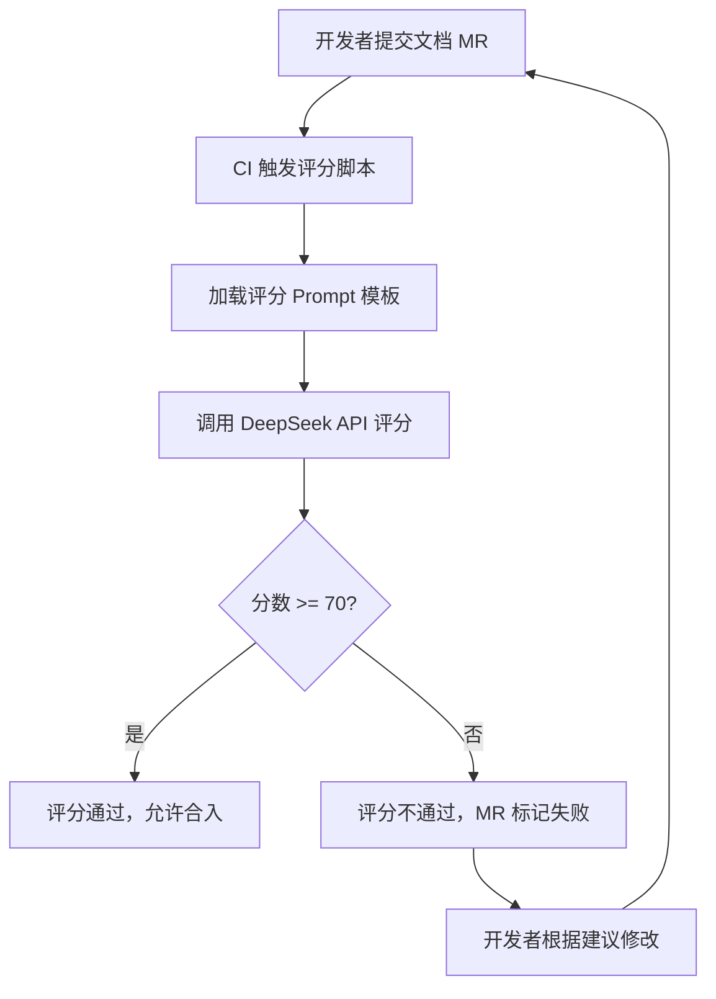
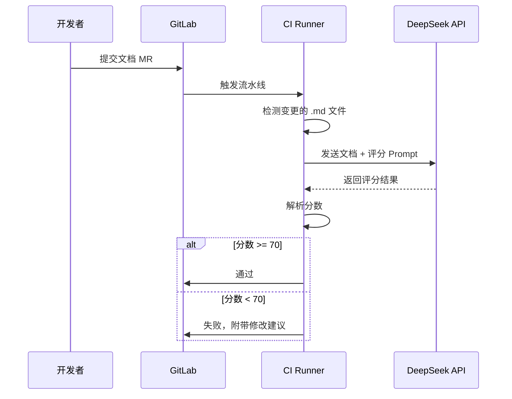

文档多了之后，质量参差不齐是必然的。我在 IoT 平台负责 50 多篇文档，改版之后内容规模更大了，靠人一篇篇看效率太低。所以我设计了一套自动评分系统，接了 DeepSeek 的 API，让 LLM 来做批量质量检查。

{/* truncate */}

## 思路

核心想法很简单：定义好评分规则，写好 Prompt 模板，用脚本把文档喂给 LLM，让它按规则打分并输出问题和修改建议。然后把这个流程塞到 CI 里，文档提交的时候自动跑一遍。

整体流程长这样：

## 评分规则设计

这是整个系统里我花时间最多的部分。不能随便让 AI 打个分就完事，得有明确的标准。

### 核心原则

1. **证据优先**：每个扣分点必须指出原文哪里有问题，不能凭感觉扣。
2. **只评文档质量**：不评价业务方案好不好。
3. **先判断类型，再选标准**：不同类型的文档关注点不一样。
4. **区分问题等级**：阻断用户完成任务的问题 vs 轻微的格式问题，扣分力度不同。

### 评分结构（满分 100）

总分 = 通用维度（60 分） + 专属维度（40 分）

通用维度所有文档都一样：

| 维度 | 分值 | 关注点 |
| --- | ---: | --- |
| 内容准确性与可信度 | 25 | 术语、参数、路径、链接是否正确 |
| 清晰可理解与一致性 | 15 | 结构、表达、格式是否统一 |
| 写作规范与文字质量 | 10 | 标题、标点、列表、代码块规范 |
| 核心目标达成度 | 10 | 读者能否完成文档应帮助完成的任务 |

专属维度按文档类型区分：

| 文档类型 | 维度 1（20 分） | 维度 2（20 分） |
| --- | --- | --- |
| 操作指南型 | 步骤完整性 | 可执行性 |
| 概念解释型 | 概念清晰度 | 决策支持与衔接 |
| API/技术参考型 | 接口完整性 | 示例可用性 |
| FAQ/排障型 | 问题覆盖度 | 解决方案闭环 |

### 分数含义

| 分数段 | 意思 |
| --- | --- |
| 90-100 | 高质量，只有轻微优化项 |
| 80-89 | 基本没问题，有优化空间 |
| 70-79 | 能用，但有明显缺口 |
| 60-69 | 风险较高，得靠经验补 |
| 60 以下 | 没达成核心目标 |

## CI 集成

评分脚本集成到 CI 流水线里，每次有文档变更的 MR 提交时自动触发。流程：

低于 70 分的 MR 没法合入，开发者得根据 AI 给出的具体建议修改之后重新提交。

## 实际跑出来的结果

拿平台上 5 篇文档试了一下：

| 指标 | 数值 |
| --- | --- |
| 平均分 | 77.6 |
| 最高分 | 85 |
| 最低分 | 68 |

大部分在 80 分左右，有一篇 68 分的确实问题比较多，AI 指出来的点和我人工审查的结论基本一致。

## 为什么选 DeepSeek

主要是便宜。这种批量评分的场景，输入 token 量大，用 GPT-4 成本太高了。DeepSeek 的效果对于文档评分来说够用，而且支持国内直接调用，不用折腾代理。

## 小结

这套系统的核心价值不在于"用了 AI"，而在于评分规则的设计。规则定得好，换哪个 LLM 都能跑。规则定得烂，用再贵的模型也没用。

AI 在这里的角色是执行者：按照我定好的标准去检查文档、输出具体问题。设计标准这事，还是得人来做。
