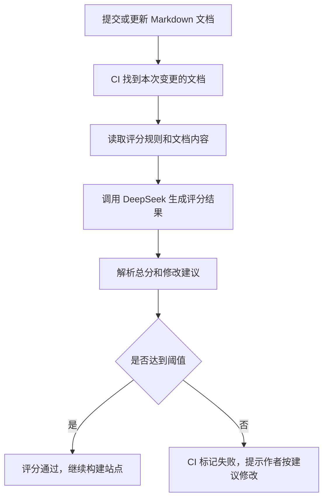
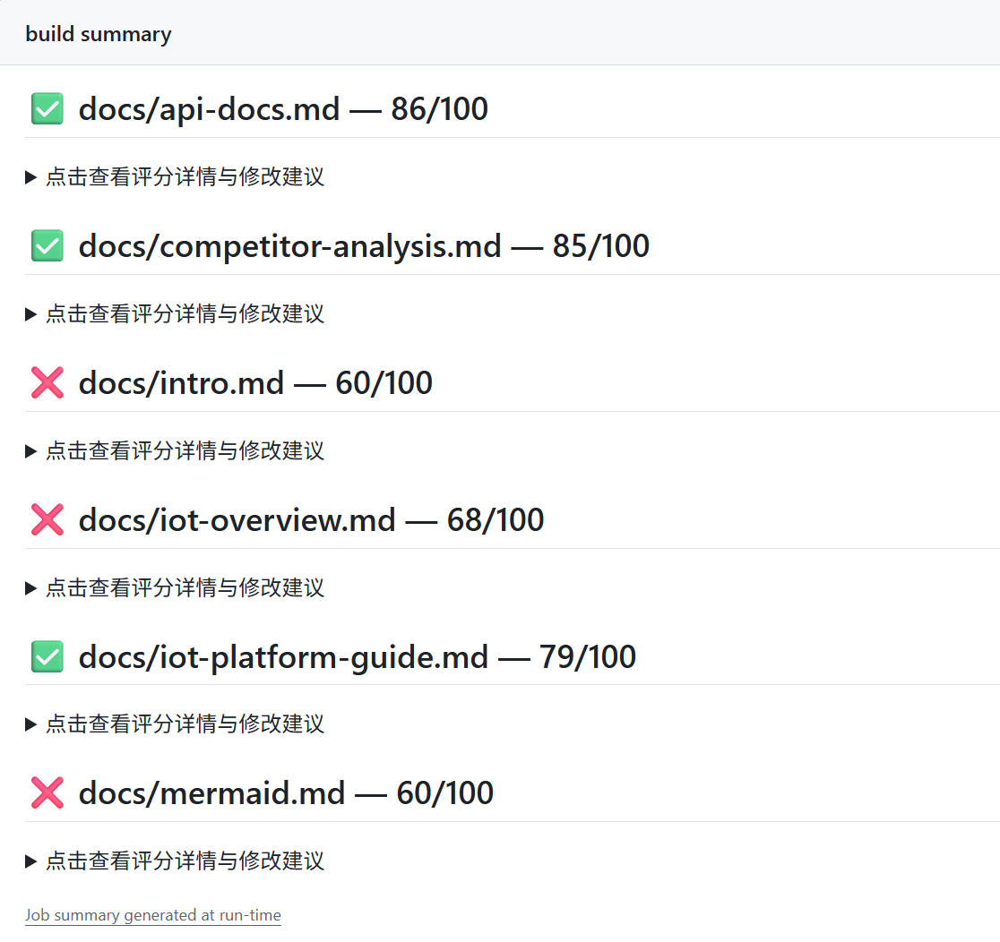

这篇想记录的不是“我接了一个模型来跑分”，而是我怎么设计一个文档质量评估助手：它按什么标准看文档，怎么输出修改建议，又怎么接到 CI 流程里，让每次文档更新都有一轮质量检查。

{/* truncate */}

## 为什么要做这个助手

文档数量变多以后，单靠人工一篇篇检查会有几个问题：

| 问题 | 具体表现 |
| --- | --- |
| 标准不稳定 | 今天觉得“还行”，明天可能又觉得“不够清楚” |
| 问题不好复用 | 这篇文档踩过的坑，下一篇文档可能还会再踩一次 |
| 修改优先级不清楚 | 有些问题影响用户完成任务，有些只是表达优化，不能混在一起看 |
| CI 只能查格式 | 传统 Lint 能检查空行、标题、列表，但看不出“内容有没有讲清楚” |

所以我想做的不是一个“分数机器”，而是一个能稳定指出问题的助手。它最好能做到三件事：

1. **按统一标准看文档**：不是凭感觉说好或不好。
2. **指出具体证据**：哪里不清楚、哪里缺内容、为什么会影响读者。
3. **给出可执行建议**：开发者或文档工程师看完后知道下一步怎么改。

## 助手需要完成什么任务

我给这个助手设定的角色是：开发者平台文档质量评估助手。

它不负责判断业务方案对不对，也不负责替作者重写全文。它主要做这几件事：

| 任务 | 说明 |
| --- | --- |
| 判断文档类型 | 先判断是操作指南、概念解释、API 参考，还是流程总览 |
| 按类型套用标准 | 不同文档类型关注点不同，不能用同一把尺子硬评 |
| 给出证据型评分 | 扣分要说明依据，不能只写“内容不够好” |
| 输出修改建议 | 按 P0 / P1 / P2 标出优先级，方便后续修改 |
| 写入 CI 结果 | 让评分和建议能出现在 GitHub Actions 日志或 summary 里 |

## 我怎么设计评分规则

评分规则是这套助手里最重要的部分。AI 只是执行者，真正决定它有没有用的是规则是否清楚。

我把评分拆成两层：通用维度和文档类型维度。

### 通用维度

所有文档都要看这几项：

| 维度 | 分值 | 主要看什么 |
| --- | ---: | --- |
| 内容准确性与可信度 | 25 | 术语、路径、链接、参数、示例是否可靠 |
| 清晰可理解与一致性 | 15 | 结构是否清楚，前后说法是否一致 |
| 写作规范与文字质量 | 10 | 标题、标点、列表、表格、代码块是否规范 |
| 核心目标达成度 | 10 | 读者看完后能不能完成这篇文档本来要帮助完成的事 |

### 文档类型维度

不同类型的文档，再补两项专属维度：

| 文档类型 | 重点检查 |
| --- | --- |
| 操作指南型 | 步骤是否完整、是否可执行、有没有预期结果和排障 |
| 概念解释型 | 概念是否讲清楚、是否能帮助读者判断下一步 |
| API 参考型 | 接口信息是否完整、示例是否能照着用 |
| 流程总览型 | 是否能帮助读者看清全貌、快速选择路径 |

这样设计以后，助手不会用同一个标准去评所有文档。比如操作指南缺少异常处理是大问题，但概念解释文档更重要的是“概念关系有没有讲明白”。

## 我希望它怎么输出结果

我不希望评分结果只给一个数字。数字只能说明“过没过”，不能告诉作者怎么改。

所以我设计的输出里至少要有这些信息：

| 输出内容 | 作用 |
| --- | --- |
| 文档类型判断 | 先说明这篇文档按什么类型评分 |
| 总分和结论 | 快速判断风险高不高 |
| 评分明细 | 看清每个维度为什么扣分 |
| 内容覆盖情况 | 区分“有但不完整”和“完全缺少” |
| 核心问题与修改建议 | 告诉作者优先改什么 |
| 人工复核项 | 标出 AI 不能确认、需要人检查的内容 |

我最看重的是“核心问题与修改建议”。如果一篇文档得了 68 分，但建议里能明确指出“缺少下一步指引”“缺少决策支持”“第一人称太多”，那作者就能直接开始改。

## 整体流程怎么跑

助手本身是一个评分 Prompt 加一段脚本。流程大概是这样：

DeepSeek 在这里更像“执行评分的人”。我真正设计的是：它应该看哪些维度、怎么扣分、怎么解释问题、怎么把建议写得可执行。

## 怎么接入 CI 流程

接入 CI 后，文档更新不是直接上线，而是先经过一轮质量检查。

我希望流程是这样的：

1. 提交文档改动。
2. CI 找出本次变更的 Markdown 文档。
3. 对每篇变更文档调用质量评估助手。
4. 助手输出分数和修改建议。
5. 分数达到阈值，继续构建和部署。
6. 分数低于阈值，CI 失败，作者根据建议修改后再提交。

在这个站里，build summary 会展示每篇文档的评分结果。通过的文档显示绿色勾，未通过的文档显示红叉，点开后能看到具体评分详情和修改建议。

这个截图里，`docs/intro.md`、`docs/iot-overview.md`、`docs/mermaid.md` 当时没有通过，所以我后面就按评分建议逐篇改：导览页补阅读路径，概念页补角色判断，Mermaid 演示页后来直接删掉。

## 一次评分结果怎么落地

评分建议不能只看完就算了。我通常会把它拆成三类动作：

| 优先级 | 怎么处理 | 示例 |
| --- | --- | --- |
| P0 | 直接影响文档是否能完成目标，优先改 | 缺少下一步、缺少阅读路径、缺少异常处理 |
| P1 | 影响可用性和理解效率，第二批改 | 配置项缺少解释、验证闭环不完整 |
| P2 | 影响表达和规范，最后统一改 | 标题太大、链接文本不清楚、中英文空格 |

这比单纯看分数更有用。分数只是提醒这篇文档有风险，真正能推动质量变好的，是后面的修改建议。

## 这套助手帮我发现了什么

这次在站点里跑下来，它帮我发现了几个问题：

- 站点导览页太短，只列链接，没有帮读者选择路径。
- IoT 概念页太像个人理解，没有和平台接入流程连接起来。
- IoT 接入指南虽然步骤完整，但缺少异常处理和验证结果。
- 有些标题写得太大，像论文，不像工作记录。
- 有些页面存在感不强，比如 Mermaid 演示页，后来判断可以删掉。

这些问题如果只靠自己读，可能也能发现，但会比较慢。质量评估助手的价值是把问题集中列出来，并且按优先级提醒我先改什么。

## 小结

这套质量评估助手的重点，不是“用 DeepSeek 自动打分”这件事本身，而是把文档质量标准设计清楚，再让 AI 按这个标准稳定执行。

对我来说，它更像一个文档评审助手：帮我检查目标是否清楚、结构是否完整、读者能不能继续往下走。接入 CI 之后，每次更新文档都会自动跑一遍检查，问题会尽早暴露出来，而不是等到文档上线后才发现读者看不懂。
