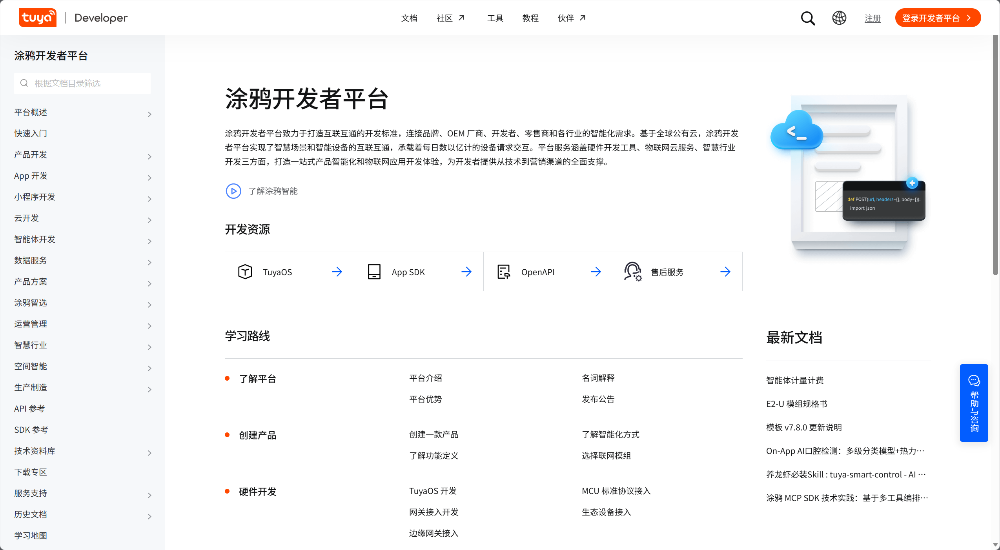
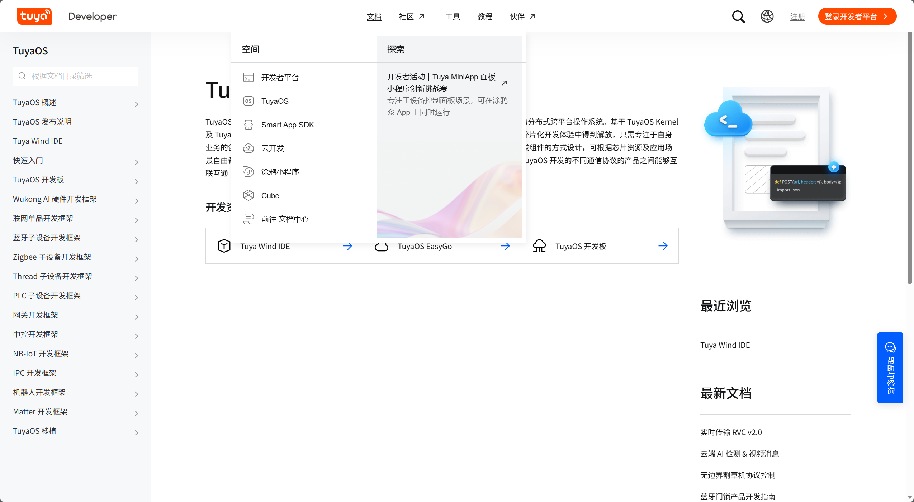
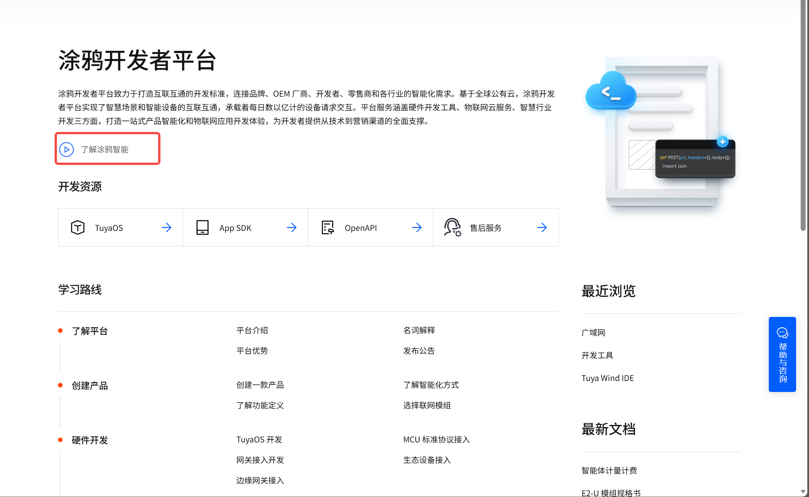

---
slug: iot-doc-thoughts
title: 一次 IoT 文档调研后的工作思考
authors: [yjh]
tags: [docs-as-code, doc-quality]
---

## 这次为什么看这些文档

### 我为什么关注这件事

随着 IoT 生态持续扩展，开发者在接入平台时，不只需要 API 或 SDK 文档，也需要一条更清晰的使用路径：从了解平台能力、创建产品、完成设备接入，到调试、上线和后续运营。

这次主要看了涂鸦智能和 Apple HomeKit，关注它们怎么组织信息、怎么引导开发者、怎么管理术语、怎么跟工具串起来。

这篇不做“谁比谁好”的判断，主要是从不同平台的做法里找一些可以参考的思路。

{/* truncate */}

> 资料说明：本文引用的外部链接均来自公开页面，平台页面可能随版本调整而变化；后续落地前需要人工复核链接有效性和页面最新内容，具体操作以对方平台最新文档为准。

这次我主要看这些点：

| 观察维度 | 关注问题 |
| --- | --- |
| 信息架构 | 导航结构、内容分层、文档分类逻辑 |
| 内容质量 | 准确性、完整性、示例质量 |
| 交互体验 | 搜索、代码示例交互、版本切换 |
| 视觉设计 | 排版、代码高亮、信息密度 |
| 开发者友好度 | 上手路径、Quick Start 设计、错误处理引导 |

看完之后，我主要想回答三个问题：

| 目标 | 说明 |
| --- | --- |
| 看做法 | 观察成熟 IoT / 智能家居平台如何组织开发者文档 |
| 找规律 | 提炼不同平台在信息架构、术语、示例、工具联动上的共性做法 |
| 找借鉴 | 总结哪些做法值得技术文档工程师学习 |

### 为什么选这两个平台

| 平台 | 选择理由 |
| --- | --- |
| **[涂鸦智能](https://developer.tuya.com/cn/docs/iot)**（developer.tuya.com） | 国内代表性的 IoT PaaS 平台，业务链路与 IoT 设备开发场景接近，文档覆盖从产品创建到量产运营的完整过程 |
| **[Apple HomeKit](https://developer.apple.com/documentation/homekit)**（developer.apple.com/apple-home 与 documentation/homekit） | 国际代表性的智能家居生态，文档边界清晰，API 结构统一，强调用户隐私、体验一致性和生态准入规则 |

---

## 我看的几个维度

结合这次观察，我主要从以下 5 个维度看：

| 维度 | 我主要看什么 |
| --- | --- |
| 信息架构 | 导航层级、内容分类、搜索和新手入口 |
| 文档结构 | API 文档格式、写作模板、同类页面是否一致 |
| 术语体系 | 核心概念有没有定义，前后用词是否统一 |
| 视觉体验 | 页面排版、留白、代码块和图片展示是否舒服 |
| 持续维护 | 更新记录、反馈入口、示例内容是否还在维护 |

这 5 个维度分别对应开发者使用文档时的几个关键问题：

- 能不能快速判断该从哪里开始。
- 能不能顺着任务路径继续往下走。
- 能不能看懂平台的核心概念。
- 能不能快速找到 API、Demo 和工具。
- 能不能感受到文档仍在持续维护。

---

## 两个平台给我的直观感受

### 涂鸦智能：更像任务路径

**文档入口**：[涂鸦开发者平台文档中心](https://developer.tuya.com/cn/docs/iot)

#### 文档体系结构

涂鸦文档给人的整体感受更像一条“做出一个 IoT 产品”的路径，而不只是一个资料库。目录从平台概述、快速入门、产品开发、硬件开发、App 开发、云开发，一直延伸到生产制造和运营管理。

| 模块 | 内容 | 更适合的阅读角色 |
| --- | --- | --- |
| [平台概述](https://developer.tuya.com/cn/docs/iot/introduction-of-tuya?id=K914joffendwh) | 平台介绍、名词解释、平台优势 | 初次了解平台的用户 |
| [快速入门](https://developer.tuya.com/cn/docs/iot/device-intelligentize-in-5-minutes?id=K914joxbogkm6) | [创建产品](https://developer.tuya.com/cn/docs/iot/device-intelligentize-in-5-minutes?id=K914joxbogkm6)、[功能定义](https://developer.tuya.com/cn/docs/iot/define-product-features?id=K97vug7wgxpoq)、[联网模组选择](https://developer.tuya.com/cn/docs/iot/network-module-overview?id=Ka4z12ojepber) | 产品经理、初次接入者 |
| 硬件开发 | [TuyaOS 开发](https://developer.tuya.com/cn/docs/iot-device-dev/TuyaOS-Overview?id=Kbfjtwjcpn1gc)、[MCU 标准协议接入](https://developer.tuya.com/cn/docs/mcu-standard-protocol)、[网关接入开发](https://developer.tuya.com/cn/docs/connect-subdevices-to-gateways) | 嵌入式工程师 |
| [App 开发](https://developer.tuya.com/cn/docs/iot/app-development?id=Kaacelrbxwoch) | [OEM App](https://developer.tuya.com/cn/docs/iot/create-an-oem-app?id=Kaplh57c61a83)、[App SDK](https://developer.tuya.com/cn/docs/iot/app-sdk-instruction?id=K9kjstc7t376p)、面板开发 | App 开发者 |
| [云开发 & OpenAPI](https://developer.tuya.com/cn/docs/cloud) | [快速入门](https://developer.tuya.com/cn/docs/iot/quick-start1?id=K95ztz9u9t89n)、[通用基础 API](https://developer.tuya.com/cn/docs/cloud/basic_api?id=Kakukjwq16z2r)、[行业通用 API](https://developer.tuya.com/cn/docs/cloud/industry_common_api?id=Kaku31z9seb63) | 云端开发者 |
| [生产制造](https://developer.tuya.com/cn/docs/iot/production?id=Kbohijqprugxv) | 模组选择、[云模组产测工具](https://developer.tuya.com/cn/docs/iot/module-prod-test?id=Kbu0fygpwirk5)、量产指引 | 制造、测试、交付团队 |
| [运营管理](https://developer.tuya.com/cn/docs/iot/operation-management?id=Kbd9xv2m3h25w) | 数据服务、OTA、设备管理 | 运营、售后、平台管理角色 |

涂鸦的结构比较像纵向流程，适合第一次接触平台的用户顺着走。相对来说，矩阵式结构更适合熟悉平台能力的用户快速定位模块。两类结构没有绝对优劣，适用场景不同。

这点值得学习的地方是：在保留平台能力矩阵的基础上，也可以补充一条更面向任务的入口，例如“接入一款设备”“调试模组”“开发 App 控制页”“准备上线量产”。这样既能保留内容的完整性，也能降低新用户的路径判断成本。

#### 值得关注的做法

1. **按产品开发过程组织内容**
   - 涂鸦不是一上来展示所有平台能力，而是先让用户知道做一个 IoT 产品大概要经过哪些步骤。
   - 目录顺序和真实团队分工比较接近：产品、硬件、App、云端、测试、运营都能找到对应入口。

2. **覆盖从接入到量产运营的完整链路**
   - 文档不只停留在开发阶段，也包含产测、生产制造、运营管理等内容。
   - 对商业化 IoT 产品来说，这类内容能减少用户在后期到处查找资料的成本。

3. **文档和工具入口连接紧密**
   - 文档侧边栏关联 [涂鸦 Wind IDE](https://developer.tuya.com/cn/ide)、[模组调试助手](https://developer.tuya.com/cn/docs/iot/module-debugging-assistant-instruction?id=K9hs0cj3lf0au)、[云模组产测工具](https://developer.tuya.com/cn/docs/iot/module-prod-test?id=Kbu0fygpwirk5)、[Demo 中心](https://developer.tuya.com/cn/demo)等资源。
   - 用户阅读完某个开发步骤后，可以比较自然地跳到对应工具继续操作。

   

4. **接入方式标准化程度较高**
   - DP 功能定义、MCU 协议、模组规范、OpenAPI 等内容有较明确的标准表达。
   - 标准化的好处是便于用户复用经验，也便于平台长期维护内容。

5. **更新信息出现在文档体系中**
   - Changelog 和更新公告不是完全脱离文档存在，例如[模板 v7.8.0 更新说明](https://developer.tuya.com/docs/iot/template-v780-update-instructions?id=Kfqo5mktbuwqt)。
   - 用户可以在查资料的同时感知平台能力变化，减少对外部通知渠道的依赖。

6. **视频入口处理得比较轻量**
   - 部分教学视频通过小图标或入口嵌入，不会直接占据大面积页面空间。
   - 对以阅读为主的技术文档来说，这种处理方式比较克制。

   

7. **Demo 和社区承担持续运营作用**
   - [Demo 中心](https://developer.tuya.com/cn/demo)提供可参考案例，[开发者社区](https://www.tuyaos.com/)承担问答和反馈功能。
   - 文档不只是静态内容，也和平台运营、开发者支持连接在一起。

#### 设计逻辑、效果与适用边界

| 观察做法 | 设计逻辑 | 可能收益 | 适用边界 |
| --- | --- | --- | --- |
| 按产品开发过程组织内容 | 先回答“做一个 IoT 产品要经历什么”，再分发到硬件、App、云端、生产等角色 | 降低新用户不知道从哪里开始的成本，也减少跨角色反复咨询 | 当链路很长时，目录和搜索维护成本会变高，需要持续治理重复内容 |
| 文档与工具入口连接紧密 | 用户读到某个步骤时，马上给出 IDE、调试助手、产测工具、Demo 等下一步入口 | 把文档从“说明材料”变成“操作入口”，提高任务完成率 | 如果工具权限、环境或版本限制没有写清，用户仍会在跳转后卡住 |
| 更新说明进入文档体系 | 把能力变化放回文档上下文，而不是只依赖公告 | 用户能在查资料时判断内容是否仍适用，减少误用旧方案 | 历史文档较多时，需要清楚标记适用版本、更新时间和是否仍推荐使用 |

---

### Apple HomeKit：更像规则体系

**文档入口**：[HomeKit Documentation](https://developer.apple.com/documentation/homekit)

#### Apple 智能家居文档的整体关系

HomeKit 文档并不是 Apple 智能家居的全部，它主要负责“App 如何发现、配置、管理和控制家庭设备”这一层。完整的 Apple Home 开发者体系还包括 Matter、Thread、MFi、Works with Apple Home 等内容。

| 文档/入口 | 主要解决的问题 |
| --- | --- |
| [Apple Home 总览](https://developer.apple.com/apple-home/) | 说明 HomeKit、Matter、Thread、MFi、Works with Apple Home 的整体关系 |
| [HomeKit Documentation](https://developer.apple.com/documentation/homekit) | App 如何发现、配置、管理和控制家庭中的智能设备 |
| [MatterSupport](https://developer.apple.com/documentation/mattersupport) | Matter 设备如何接入 Apple Home 生态 |
| [Thread / ThreadNetwork](https://developer.apple.com/documentation/threadnetwork) | 低功耗 Mesh 智能家居网络相关能力 |
| [HomeKit HIG](https://developer.apple.com/design/human-interface-guidelines/homekit) | 智能家居 App 的交互、术语和体验规范 |
| [HomeKit Accessory Simulator](https://developer.apple.com/documentation/homekit/testing-your-app-with-the-homekit-accessory-simulator) | 在没有真实设备时模拟配件进行调试 |
| [MFi](https://developer.apple.com/programs/mfi/) / [Works with Apple Home](https://developer.apple.com/apple-home/works-with-apple-home/) | 硬件厂商的认证、品牌准入和上市规则 |

Apple 的文档给人的感觉比较克制。它不会把所有内容都放在一个页面里，而是把边界分得很清楚：HomeKit 讲 App 控制设备，Matter 和 Thread 讲连接标准，MFi 和 Works with Apple Home 更偏认证和生态准入。

这和涂鸦的侧重点不同。涂鸦更像是帮助用户完成一条 IoT 产品开发和商业化链路；Apple 更像是在定义进入 Apple Home 生态时需要遵守的规则和体验边界。

#### HomeKit 文档本身的结构

HomeKit 文档的核心结构围绕几个基础对象展开：`Home`、`Accessory`、`Service`、`Characteristic`。这套模型把智能家居中的复杂设备拆成了相对稳定的层级。

| 模块 | 内容 | 产品意义 |
| --- | --- | --- |
| [Essentials](https://developer.apple.com/documentation/homekit/enabling-homekit-in-your-app) | 开启 HomeKit 能力、申请用户权限 | 把隐私授权作为接入第一步 |
| [Home Manager](https://developer.apple.com/documentation/homekit/hmhomemanager) | 主家庭、家庭配置 | 抽象“家庭”这个核心容器 |
| [Accessories](https://developer.apple.com/documentation/homekit/hmaccessory) | [配件](https://developer.apple.com/documentation/homekit/hmaccessory)、[服务](https://developer.apple.com/documentation/homekit/hmservice)、[属性](https://developer.apple.com/documentation/homekit/hmcharacteristic)三级模型 | 把复杂设备拆成标准化层级 |
| [Accessory Setup](https://developer.apple.com/documentation/homekit/hmaccessorysetupmanager) | 添加和配置新配件 | 支撑设备配网和绑定流程 |
| [Interactions](https://developer.apple.com/documentation/homekit/interacting-with-a-home-automation-network) | 读取状态、控制设备、监听变化 | 覆盖智能家居最核心的控制闭环 |
| [Action Sets](https://developer.apple.com/documentation/homekit/hmactionset) | 场景、自动化、定时和事件触发 | 支撑家庭场景联动 |
| [Errors](https://developer.apple.com/documentation/homekit/hmerror) | 错误码和异常处理 | 处理权限、设备状态、调用失败等异常 |
| [Testing](https://developer.apple.com/documentation/homekit/testing-your-app-with-the-homekit-accessory-simulator) | HomeKit Accessory Simulator | 降低没有真实硬件时的调试门槛 |

#### 值得关注的做法

1. **对象模型非常清楚**
   - `Home → Accessory → Service → Characteristic` 四层模型让智能家居对象关系变得稳定。
   - 开发者不需要直接理解每个厂商设备的底层差异，而是围绕统一模型进行操作。
   - 这点值得学习的地方是：平台如果有自己的标准对象模型，就应该在文档里反复讲清楚模型关系和使用示例。

2. **文档边界清楚**
   - 公开 [HomeKit 文档](https://developer.apple.com/documentation/homekit)主要讲 App 和框架。
   - 硬件协议、认证、品牌授权等内容由 [MFi](https://developer.apple.com/programs/mfi/)、[Works with Apple Home](https://developer.apple.com/apple-home/works-with-apple-home/) 等入口承接。
   - 对平台文档来说，不同角色的任务边界越清楚，用户越容易判断当前内容是否适合阅读。

3. **术语管理比较严格**
   - `Home`、`Accessory`、`Service`、`Characteristic` 等核心概念定义明确。
   - 同一概念在不同页面中保持一致表达。
   - 术语一致性会直接影响文档的可信度，也会减少跨团队沟通成本。

4. **API 文档格式统一**
   - API 页面通常按照声明、说明、参数、返回值、相关 API、可用版本等结构组织。
   - 用户阅读几个页面后，就能形成稳定预期，知道要去哪里找信息。
   - 版本支持和废弃说明也比较清楚，方便用户判断兼容性。

5. **把用户隐私放在接入前置位置**
   - HomeKit 文档强调家庭自动化网络是敏感资源。
   - App 可能读取传感器数据，也可能改变真实世界中设备的状态，因此必须向用户说明用途并获得授权。
   - 对 IoT 文档来说，这种“先讲权限和边界，再讲能力使用”的顺序值得参考。

6. **测试链路比较成熟**
   - [HomeKit Accessory Simulator](https://developer.apple.com/documentation/homekit/testing-your-app-with-the-homekit-accessory-simulator) 可以模拟灯、门锁、车库门、摄像头等设备。
   - App 开发者即使没有真实硬件，也能完成较多调试工作。
   - 这类模拟工具能明显降低新用户进入平台的门槛。

#### UI 与视觉体验

- 页面留白充足，阅读压力较小。
- 标题、正文、代码块和提示信息层级清楚。
- 视觉风格克制，重点放在内容本身。
- 移动端适配较好，适合碎片化查阅。

#### 设计逻辑、效果与适用边界

| 观察做法 | 设计逻辑 | 可能收益 | 适用边界 |
| --- | --- | --- | --- |
| 用对象模型组织 HomeKit 能力 | 先稳定 `Home → Accessory → Service → Characteristic` 这套抽象，再解释 API 使用 | 开发者能用同一套语言理解不同设备，API 页面之间的迁移成本更低 | 对初次接触 Apple Home 生态的用户来说，还需要先理解 HomeKit、Matter、Thread、MFi 之间的关系 |
| 把公开文档和受控资料分层 | 公开文档负责框架、体验和 API，认证、协议和品牌准入由受控入口承接 | 不同角色能更快判断自己该读哪类资料，也能降低敏感资料误用风险 | 硬件认证和协议细节不在公开页面完整呈现，外部观察只能覆盖公开信息 |
| 把隐私和权限放在接入前置位置 | 智能家居会影响真实设备和家庭数据，所以先说明权限边界，再讲能力调用 | 用户授权、App 审核和开发实现之间的预期更一致 | 这种写法更适合生态规则清晰的平台，不能直接替代完整的硬件量产流程 |

---

## 我觉得可以先改什么

### 我从这两类平台里看到的共性

通过涂鸦和 Apple 的文档可以看到，成熟的开发者文档通常不只是“资料堆叠”，而是在帮助用户完成任务。

1. **围绕用户任务组织内容**
   - 涂鸦更像一条产品开发链路，适合带用户从接入走到量产。
   - Apple 更像分层规则体系，适合帮助用户理解生态边界和 API 模型。
   - 两者共同点是：文档不是只展示平台有什么，而是解释用户该如何使用这些能力。

2. **新用户需要清楚的起步路径**
   - 快速入门、Sample Code、Demo、模拟器等内容都在降低首次接入门槛。
   - 对开发者文档来说，能否在短时间内跑通第一个流程，会影响后续使用意愿。

3. **术语一致性会影响专业感**
   - Apple 对核心对象模型的命名非常稳定。
   - 涂鸦也有名词解释和标准化功能定义。
   - 当术语稳定后，用户在不同页面之间切换时不容易产生理解偏差。

4. **API 文档需要形成固定结构**
   - 同类型页面结构统一后，用户查资料的速度会变快。
   - 对平台来说，统一模板也有利于后续维护和多人协作。

5. **文档需要持续运营机制**
   - Changelog、社区、Demo、反馈入口都能让用户感受到平台在持续维护。
   - 文档不是一次性发布内容，而是平台能力演进的一部分。

### 值得学习的做法

结合两类平台的做法，我觉得下面几件事很值得学习：

| 做法 | 可以借鉴的点 |
| --- | --- |
| 任务型导航 | 不只按功能模块分类，也给新用户一条“先做什么、再做什么”的路径 |
| 核心概念先讲清楚 | 在进入具体 API 或操作前，先解释对象模型、术语和边界 |
| 同类页面保持固定结构 | API、教程、FAQ 等页面最好有稳定模板，读者看几页后能形成预期 |
| 文档和工具互相连接 | 在合适的位置放 Demo、调试工具、模拟器或下载入口，让读者能继续操作 |
| 版本和状态写清楚 | 更新时间、适用范围、废弃状态、推荐版本都能减少误用 |

这些做法不一定要原样照搬，但都说明了一件事：好的开发者文档不是简单堆资料，而是在帮读者更快找到路径、理解概念、完成任务。

---

## 最后一点想法

涂鸦和 Apple 的文档侧重点不同，但都说明了一点：开发者文档不只是内容集合，它也是平台体验的一部分。

对新用户来说，文档需要回答“从哪里开始”；对有经验的用户来说，文档需要帮助其快速找到 API、规范、工具和版本信息；对平台来说，文档还承担着统一术语、传递标准、降低支持成本的作用。
