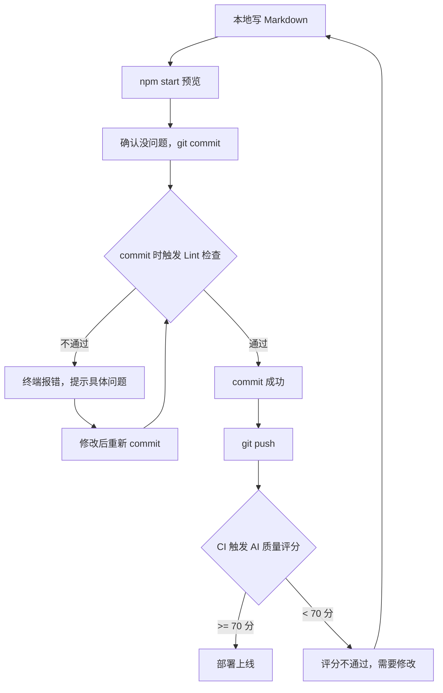

记录一下我日常更新这个站点内容的完整流程。从本地写文档到最终上线，中间经过了格式检查和 AI 质量评分两道关卡。

{/* truncate */}

## 整体流程



## 第 1 步 - 本地写文档

用 VS Code 打开项目，在 `docs/` 或 `blog/` 目录下新建/修改 Markdown 文件。

修改后可以在终端运行 `npm start` 预览文档渲染效果。

浏览器会打开 `localhost:3000`，改了文件保存后页面会自动刷新，所见即所得。


:::tip 注意事项
`npm start` 启动时会自动做一轮检查，包括配置项是否合法、侧边栏引用的文档是否存在、内部链接是否有效、图片路径是否正确等。如果有问题会直接在终端报错并提示具体位置，把报错信息复制给 AI 就能快速定位和修复。
:::

## 第 2 步 - commit 时自动检查格式

我在项目里配了 Git hook，每次 `git commit` 的时候会自动跑 markdownlint 检查。不符合规范的文件会被拦住，commit 不会成功。

终端会直接提示哪个文件的哪一行有什么问题，比如：

```text
docs/iot-overview.md:15 MD022/blanks-around-headings Headings should be surrounded by blank lines
docs/api-docs.md:42 MD032/blanks-around-lists Lists should be surrounded by blank lines
```

看到报错之后，按提示改完再重新 commit 就行。大部分格式问题也可以用 `npm run lint:fix` 自动修复：

```bash
npm run lint:fix
```


检查的规则是根据中文技术文档的习惯定的，主要包括：

- 标题前后要有空行。
- 标题层级不能跳（比如 H1 直接到 H3）。
- 列表前后要有空行。
- 代码块要标注语言类型。

## 第 3 步 - push 后触发 AI 质量评分

commit 通过 Lint 检查后，`git push` 到 GitHub。推上去之后 CI 会自动触发一轮 AI 质量评分，调用 DeepSeek API 对变更的文档打分。

评分标准包括内容准确性、结构清晰度、写作规范等维度（详见[文档质量评分系统](/blog/doc-score)）。

- 70 分及以上：评分通过，自动部署上线。
- 70 分以下：评分不通过，需要根据 AI 给出的具体问题和修改建议改完再推。


## 为什么要这么搞

两道检查解决的是不同层面的问题：

| 检查环节 | 解决什么问题 | 什么时候跑 |
| --- | --- | --- |
| Lint（本地） | 格式规范，比如标题层级、空行、列表格式 | commit 的时候 |
| AI 评分（CI） | 内容质量，比如逻辑是否清晰、步骤是否完整 | push 的时候 |

Lint 管格式，AI 管内容。格式问题本地就能解决，不用等到 CI 再报错；内容质量需要整篇通读才能判断，交给 AI 在 CI 里跑更合适。

## 小结

整个流程下来，基本不会有"格式乱七八糟"或者"内容质量很差"的文档被发布出去。虽然多了两道卡，但日常写文档的体验其实没受太大影响——Lint 大部分能自动修复，AI 评分只有写得确实有问题的时候才会拦。
