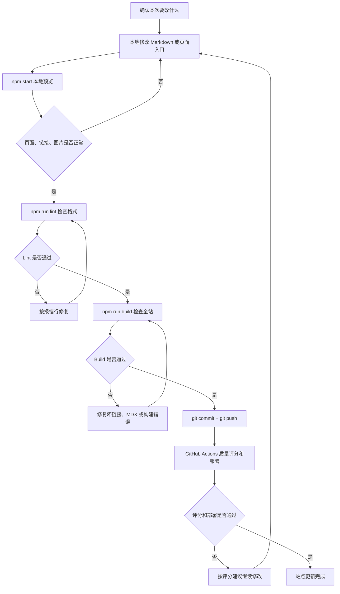
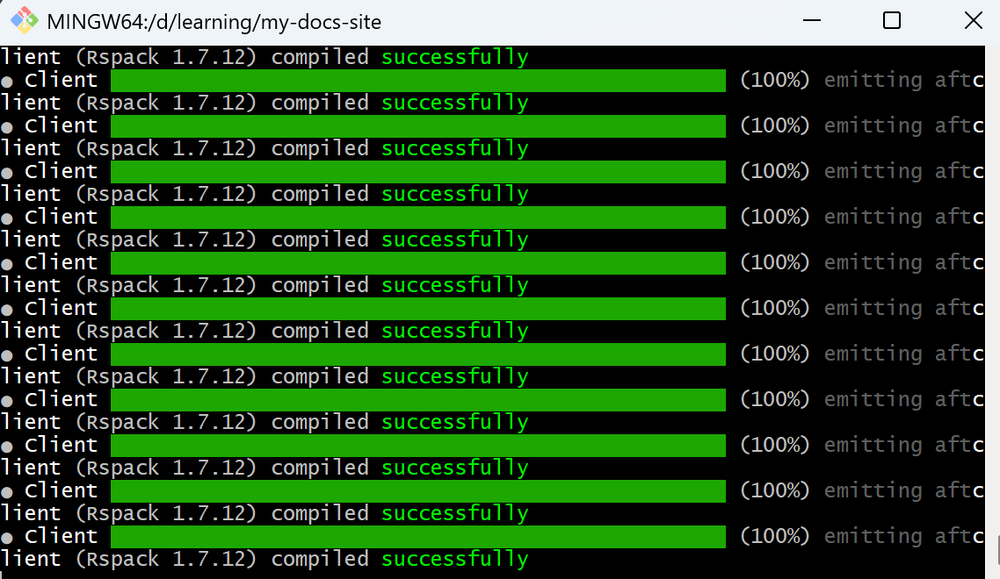
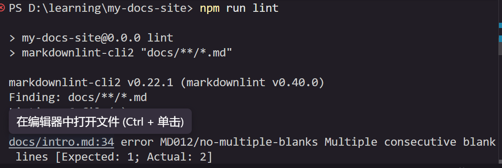

这篇记录我一般怎么更新这个文档站。

{/* truncate */}

## 适用场景

这个流程适合三类更新：

| 更新类型 | 示例 | 主要检查点 |
| --- | --- | --- |
| 修改文档作品 | 调整 `docs/iot-platform-guide.md` 的步骤、截图说明或排障内容 | 链接、图片、步骤顺序、预期结果是否完整 |
| 更新建站手记 | 新增或修改 `blog/` 下的文章 | 标题、标签、摘要、内部链接是否清楚 |
| 调整站点结构 | 修改侧边栏、首页卡片、导览页入口 | 路由是否存在，旧链接是否清理干净 |

如果只是改错别字，可以直接走“修改 → 预览 → 提交”的短流程；如果是新增页面或调整导航，最好完整跑一遍本地构建。

## 整体流程



## 更新前先判断改动范围

动手前先确认这次改动属于哪一类，能减少后面漏改入口或误删文件的概率。

| 判断问题 | 如果是 | 需要额外检查 |
| --- | --- | --- |
| 是否新增或删除 `docs/` 页面？ | 是 | 检查 `sidebars.ts`、`docs/intro.md` 和首页卡片是否需要同步 |
| 是否新增或删除 `blog/` 文章？ | 是 | 检查 front matter、标签、导览页和相关文章链接 |
| 是否移动了图片？ | 是 | 检查 Markdown 图片相对路径是否还正确 |
| 是否修改了标题或 slug？ | 是 | 搜索旧标题和旧链接，避免留下坏链接 |
| 是否只是改正文？ | 是 | 重点检查段落结构、表格、链接和截图说明 |

我现在通常会先用 `rg` 搜一下旧标题或旧路径，确认哪些地方引用了它，再决定要不要同步改导览页、首页或其他文章。

## 第 1 步 - 本地写文档

用编辑器打开项目，在 `docs/` 或 `blog/` 目录下修改 Markdown 文件。常见改动包括：

- 给操作指南补充前提条件、预期结果和常见问题。
- 给概念文档补充角色判断、下一步链接和术语解释。
- 调整建站手记的标题、语气和结构。
- 删除价值不高的页面，并同步清理导航入口。

如果是新增博客，front matter 至少要包含 `slug`、`title`、`authors` 和 `tags`。如果文章较长，正文前面保留 `{/* truncate */}`，避免博客列表页预览太长。

## 第 2 步 - 本地预览页面

修改后运行：

```bash
npm start
```

浏览器会打开 `localhost:3000`，保存文件后页面会自动刷新。



本地预览时重点看这些点：

| 检查项 | 怎么看 |
| --- | --- |
| 页面是否能打开 | 直接访问修改后的页面和站点导览页 |
| 图片是否显示 | 检查图片路径、文件名和相对目录是否正确 |
| 表格是否可读 | 看列宽是否过长，是否有重复或空列 |
| Mermaid 图是否渲染 | 看流程图是否正常显示，节点文案是否清楚 |
| 内部链接是否可点击 | 点击导览页、首页卡片和正文里的关键链接 |

:::tip
`npm start` 适合边写边看，但它不等于完整发布检查。改完重要结构后，还要跑 `npm run build`，因为构建会更严格地检查坏链接、MDX 语法和页面生成问题。
:::

## 第 3 步 - 检查 Markdown 格式

提交前运行：

```bash
npm run lint
```

这个命令会检查 `docs/` 下的 Markdown 格式。常见问题包括标题前后缺空行、列表前后缺空行、代码块没有语言类型等。

如果看到类似下面的报错，就按文件名和行号去改：

```text
docs/iot-overview.md:15 MD022/blanks-around-headings Headings should be surrounded by blank lines
docs/api-docs.md:42 MD032/blanks-around-lists Lists should be surrounded by blank lines
```

大部分格式问题可以先尝试自动修复：

```bash
npm run lint:fix
```



## 第 4 步 - 构建全站

格式检查通过后，再运行：

```bash
npm run build
```

构建主要帮我确认这些问题：

| 报错类型 | 常见原因 | 处理方式 |
| --- | --- | --- |
| Broken link | 页面被删除、slug 改了、内部链接没同步 | 搜索旧路径，改成新路径或删除入口 |
| MDX compilation failed | Markdown 中写了不兼容的 JSX、注释或特殊字符 | 按报错行修正文档语法 |
| Image not found | 图片移动后路径没改，或文件名大小写不一致 | 检查图片实际位置和 Markdown 引用 |
| Sidebar item not found | `sidebars.ts` 引用了不存在的文档 | 删除旧 sidebar 项或补回文档 |

我一般会把 `npm run build` 当成“能不能发出去”的最后一道本地检查。只要它能过，至少说明站点可以完整生成。

## 第 5 步 - 提交并推送

本地检查通过后，再提交代码：

```bash
git status
git add .
git commit -m "docs: 更新文档内容"
git push
```

提交前会再看一眼 `git status`，确认没有把无关文件一起提交进去。尤其是移动文档或图片时，要确认旧文件已经删除，新文件也已经加入版本控制。

## 第 6 步 - 看 GitHub Actions 结果

推送后 GitHub Actions 会跑两类检查：

| 环节 | 主要作用 | 失败后怎么处理 |
| --- | --- | --- |
| 文档质量评分 | 调用 DeepSeek API，对变更文档给出分数和修改建议 | 打开失败日志，按 P0 / P1 / P2 建议逐项修改 |
| 站点构建部署 | 构建 Docusaurus，并部署到 GitHub Pages | 根据构建日志修复坏链接、图片路径或 MDX 语法 |

下面这张图就是一次 build summary 的结果：每篇变更文档会显示评分，未达标的文档会用红叉标出来，点开后可以看到具体评分详情和修改建议。


如果质量评分低于阈值，我不会只为了分数做表面修改，而是优先看评分里提到的“核心问题与修改建议”。通常可以按这个顺序处理：

1. **先改 P0**：比如目标不清楚、缺少下一步、缺少异常处理。
2. **再改 P1**：比如配置说明不够、验证闭环不完整。
3. **最后改 P2**：比如标题语气、链接文本、中英文空格。

这次站点里几篇文档就是按这个方式改的：先补导览页的阅读路径，再补概念文档的角色判断，最后补操作指南里的排障和验证结果。

## 常见更新场景

### 删除一篇文档

删除文档时，不只是删文件，还要同步清理引用：

- 从 `sidebars.ts` 删除旧文档 ID。
- 从 `docs/intro.md` 删除旧入口或阅读路径。
- 从首页、博客或其他文档中搜索旧链接。
- 运行 `npm run build`，确认没有 broken link。

### 移动一篇文章

如果把文章从 `docs/` 移到 `blog/`，需要额外注意：

- 给博客补齐 `slug`、`title`、`authors`、`tags`。
- 图片要跟着移动，或改成新的相对路径。
- 原来的 `/docs/...` 链接要改成 `/blog/...`。
- 如果标题也改了，要同步导览页和首页卡片。

### 根据 AI 评分建议修改文档

评分建议通常会指出“缺什么”和“影响是什么”。我会把它拆成可执行动作：

| 评分问题 | 修改方式 |
| --- | --- |
| 缺少阅读路径 | 增加推荐阅读顺序、目标读者和下一步链接 |
| 缺少决策支持 | 增加判断清单、角色分流或选型说明 |
| 缺少异常处理 | 在关键步骤后补“常见问题”和“预期结果” |
| 描述太主观 | 改成更客观的“主要内容”“适合读者”“验收标准” |

## 小结

这个更新流程的重点不是“多跑几个命令”，而是把文档修改变成一个可复核的闭环：本地能看、格式能过、全站能构建、CI 能评分，最后用户打开站点时能顺着路径读下去。

对我来说，这也是把文档站搭起来以后最有价值的地方：文档不是写完就结束，而是可以持续检查、持续修改、持续上线。
