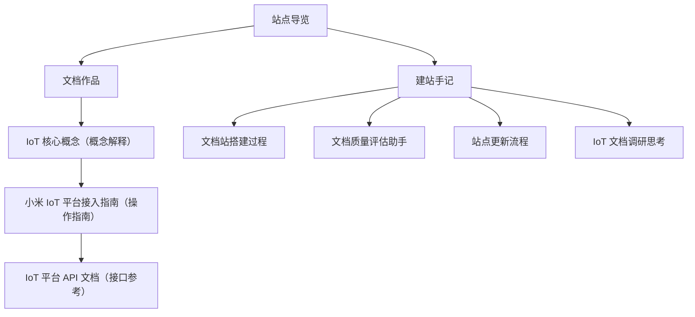

# 站点导览

这是一个技术文档作品集，主要展示我在 **IoT 文档写作、文档工程、内容质量流程** 方面的实践。你可以把这一页当成站点地图：先判断自己想看什么，再按推荐路径阅读。

## 快速选择

| 你的目标 | 推荐先看 | 适合场景 |
| --- | --- | --- |
| 想快速了解 IoT 接入前核心概念 | [IoT 核心概念](/docs/iot-overview) | 第一次接触 IoT、智能家居或平台接入流程 |
| 想看完整操作型文档 | [小米 IoT 平台接入指南](/docs/iot-platform-guide) | 关注产品创建、配置、调试、测试和上线流程 |
| 想看 API 参考文档写法 | [IoT 平台 API 文档](/docs/api-docs) | 关注接口结构、请求参数、响应示例和错误处理 |
| 想看建站和文档维护思考 | [建站手记](#建站手记) | 关注建站过程、质量评分、更新流程和工作复盘 |

## 站点地图

## 推荐阅读路径

| 读者或目标 | 推荐顺序 | 必读/选读建议 | 预计投入 |
| --- | --- | --- | --- |
| IoT 新手 | [IoT 核心概念](/docs/iot-overview) → [小米 IoT 平台接入指南](/docs/iot-platform-guide) | 核心概念必读，接入指南可先读前半部分 | 20～40 分钟 |
| 想看操作指南能力 | [小米 IoT 平台接入指南](/docs/iot-platform-guide) → [IoT 平台 API 文档](/docs/api-docs) | 接入指南必读，API 文档按需查看 | 35～60 分钟 |
| 想看 API 文档能力 | [IoT 平台 API 文档](/docs/api-docs) | API 文档必读，可按接口场景查阅 | 20～30 分钟 |
| 想了解文档站维护 | [我是怎么搭这个文档站的](/blog/docs-as-code) → [我是怎么设计文档质量评估助手的](/blog/doc-score) → [我是怎么更新这个文档站的](/blog/update-workflow) | 三篇都建议阅读，能看到从搭建到质量控制的完整链路 | 30～50 分钟 |
| 想看工作思考 | [一次 IoT 文档调研后的工作思考](/blog/iot-doc-thoughts) → [小米 IoT 平台接入指南](/docs/iot-platform-guide) | 先看思考，再回到具体文档验证改进方向 | 25～45 分钟 |

## 文档作品

这些内容更偏“作品集”，用来展示不同类型技术文档的写法和组织方式。

| 文档 | 适合读者 | 主要内容 | 阅读前提 | 难度 / 时间 | 阅读建议 |
| --- | --- | --- | --- | --- | --- |
| [IoT 核心概念](/docs/iot-overview) | IoT 新手、产品经理、想快速理解接入链路的人 | 解释产品、设备、Spec、模组、固件、PID、DID 等接入前必须理解的概念 | 无 | 入门 / 10～15 分钟 | 如果不熟悉 IoT 接入流程，建议先读 |
| [小米 IoT 平台接入指南](/docs/iot-platform-guide) | 嵌入式开发者、测试人员、技术文档工程师 | 按接入流程说明产品创建、功能定义、扩展程序、固件开发、测试和上线申请 | 建议先了解 IoT 核心概念 | 进阶 / 25～40 分钟 | 想看完整流程时必读 |
| [IoT 平台 API 文档](/docs/api-docs) | 后端开发者、函数计算开发者、API 文档读者 | 展示认证方式、统一响应、设备控制、数据存储、缓存等接口写法 | 了解基本 HTTP / JSON 概念 | 进阶 / 20～30 分钟 | 适合按接口场景查阅 |

## 建站手记

这些内容更偏“过程记录”和“工作思考”，用来说明这个站点是怎么搭建、维护和改进的。

| 文章 | 适合读者 | 主要内容 | 难度 / 时间 | 阅读建议 |
| --- | --- | --- | --- | --- |
| [一次 IoT 文档调研后的工作思考](/blog/iot-doc-thoughts) | 技术文档工程师、产品经理、关注文档体验的人 | 记录从涂鸦、Apple HomeKit 等文档里整理出的导航、术语、工具联动思考 | 入门 / 10～15 分钟 | 想看工作思考时先读 |
| [我是怎么搭这个文档站的](/blog/docs-as-code) | 想了解建站过程的人 | 说明为什么要搭站、站点怎么分区、首页和导览页怎么设计 | 入门 / 8～12 分钟 | 适合了解站点背景 |
| [我是怎么设计文档质量评估助手的](/blog/doc-score) | 关注文档质量流程的人 | 说明质量评估助手的规则设计、输出内容和 CI 接入方式 | 进阶 / 10～15 分钟 | 适合了解质量评估流程 |
| [我是怎么更新这个文档站的](/blog/update-workflow) | 想复用更新流程的人 | 记录从本地写文档、Lint 检查、全站构建、AI 评分到部署上线的流程 | 入门 / 10～15 分钟 | 适合了解日常维护方式 |

## 阅读标记

- **必读**：如果你第一次进入站点，建议先看 [IoT 核心概念](/docs/iot-overview) 和 [小米 IoT 平台接入指南](/docs/iot-platform-guide)。
- **按需查阅**：如果你只关心接口写法，可以直接看 [IoT 平台 API 文档](/docs/api-docs)。
- **选读**：如果你关注建站过程或文档工程思考，可以看建站手记。
- **验证顺序**：概念解释 → 操作指南 → API 参考，是最适合理解 IoT 接入文档的阅读顺序。
