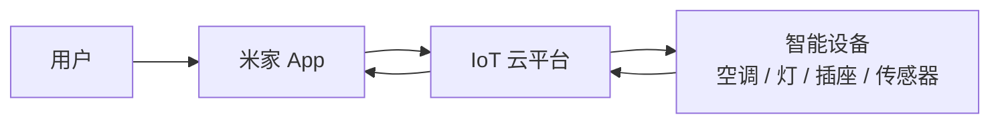
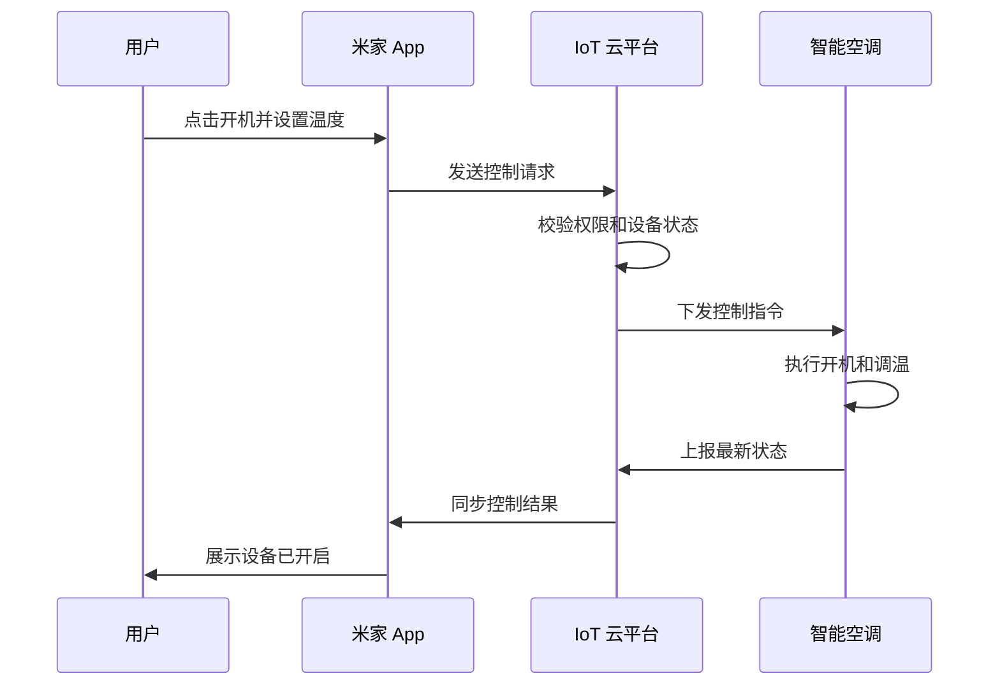

# IoT 基础概念说明：以小米智能家居为例

刚接触 IoT 项目时，我其实并不理解“IoT”到底是什么。它听起来像一个很大的技术概念，和设备、模组、固件、云平台、App 都有关，但很难一下子说清楚它具体解决什么问题。

后来我发现，对一个非 IoT 背景的人来说，最容易理解的入口不是协议、芯片或平台架构，而是一个很日常的场景：

> 如果家里的空调接入了 IoT 系统，用户就可以在快到家之前，通过米家 App 提前打开空调。等回到家时，房间已经是合适的温度。

这个例子很简单，但它基本说明了 IoT 的核心价值：**让原本只能在现场操作的设备，具备被远程感知、控制和管理的能力。**

这篇文档不尝试完整介绍整个 IoT 行业，而是以小米智能家居为例，说明我作为文档工程师对 IoT 基础概念、系统链路和文档写作重点的理解。

---

## 这篇文档想说明什么

IoT 的应用范围很广，智能家居只是其中一个比较容易理解的场景。工业制造、智慧城市、车联网、智慧农业也都属于更大的 IoT 范畴，但这些不是我主要接触的方向。

因此，这篇文档会把范围收窄到消费级智能家居，重点说明三个问题：

- IoT 是什么，为什么智能设备需要接入 IoT？
- 一个智能家居 IoT 系统里，设备、App 和云平台分别做什么？
- 文档工程师在写 IoT 文档时，应该重点帮读者解决什么问题？

如果需要了解更具体的平台操作流程，可以继续阅读：[小米 IoT 开发者平台接入指南](./iot-platform-guide.md)。

## 先用智能空调理解 IoT

传统空调主要依赖遥控器或机身按键。用户必须在空调附近，才能开机、关机、调温或切换模式。

接入 IoT 后，空调的使用方式发生了变化。用户不一定要站在设备旁边，也不一定要拿着遥控器，很多操作可以在手机 App 中完成：

- 快到家前，提前打开空调。
- 出门后，确认空调是否已经关闭。
- 晚上睡觉时，让空调自动切换到睡眠模式。
- 把设备共享给家人，让不同家庭成员都可以控制。

从这个场景看，IoT 并不是“让设备多一个 App 入口”这么简单。真正发生变化的是：设备不再只是一个孤立的硬件，而是进入了一套由设备、网络、云平台和 App 组成的系统。

## IoT 到底是什么

IoT 是 `Internet of Things` 的缩写，中文通常叫“物联网”。如果不用特别技术化的说法，可以这样理解：

> IoT 是把物理设备连接到网络中，让设备可以上报状态、接收指令，并和 App、云平台或其他设备协同工作。

在智能家居场景里，一个设备接入 IoT 后，通常会具备几类能力：

- **状态上报**：设备可以告诉平台自己当前是什么状态，例如空调是否开机、当前温度是多少。
- **远程控制**：用户可以通过 App 下发指令，例如打开空调、调整温度、切换模式。
- **自动化联动**：设备可以根据时间、环境或其他设备状态自动执行动作，例如温度过高时打开空调。
- **设备管理**：平台可以管理设备绑定关系、固件版本、权限和上线状态。

所以，IoT 不是单点功能，而是一条链路。只看 App，会忽略设备端和云平台；只看设备，又看不到用户操作和平台管理。

## 一个智能家居 IoT 系统里有什么

从用户角度看，远程控制空调只是“在 App 上点一下”。但从系统角度看，这个动作至少经过了 App、云平台和设备端。

我会把这条链路拆成几个部分理解：

- **用户**：真正发起操作的人，例如打开空调、设置温度、查看设备状态。
- **App**：用户操作设备的入口，负责展示设备页面、发送控制请求、展示控制结果。
- **IoT 云平台**：负责管理设备、校验权限、转发指令、同步设备状态。
- **设备端**：真正执行动作的硬件，例如空调完成开机和调温。
- **网络连接**：让设备能够和平台通信，例如 Wi-Fi、蓝牙或网关连接。
在更具体的开发场景里，还会涉及模组、MCU、固件、协议、认证测试等内容。但如果是给入门读者解释 IoT，先让他们理解这条链路，比一开始解释底层技术更重要。

## 远程打开空调时发生了什么

继续用“快到家前打开空调”这个例子。一次看起来很简单的远程控制，大致可以拆成下面几步：

1. 用户打开米家 App，进入空调设备页面。
2. 用户点击开机，并设置目标温度。
3. App 把控制请求发送到 IoT 云平台。
4. 云平台确认用户是否有权限、设备是否在线。
5. 云平台把控制指令下发给空调。
6. 空调执行开机和调温动作。
7. 空调把最新状态上报给云平台。
8. App 同步展示新的设备状态。

这也是 IoT 文档容易复杂的原因：用户看到的是一个按钮，但文档工程师需要知道按钮背后有哪些环节。只要其中一个环节出问题，用户看到的可能就是“设备离线”“控制失败”或“状态不同步”。

## IoT 文档为什么不好写

我以前以为，技术文档主要是把功能和步骤写清楚。接触 IoT 之后，我最大的感受是：IoT 文档经常不是单纯写“怎么操作”，而是在帮不同角色建立同一套理解。

### 读者不是同一种人

一篇 IoT 文档可能会被设备厂商、固件开发者、App 开发者、测试人员、平台运营人员同时阅读。他们都在看“设备接入”，但关心的问题完全不同。

例如：

- 设备厂商关心产品怎么创建、什么时候能上线。
- 固件开发者关心设备怎么响应指令、怎么上报状态。
- 测试人员关心功能是否符合测试标准。
- 平台运营人员关心资料是否完整、流程是否合规。
- 文档工程师需要把这些问题放在同一套文档结构里。

如果文档没有先区分读者，内容就很容易变成一大段混在一起的信息。

### 流程长，而且前提条件多

IoT 接入通常不是“调用一个接口就完成”。它可能包含账号权限、产品创建、功能定义、固件配置、设备配网、联调测试、认证审核、上线申请等多个阶段。

很多问题并不发生在当前步骤本身，而是前面的准备没有完成。例如：

- 账号没有对应权限，导致平台按钮不可用。
- 手机没有开启蓝牙，导致设备无法被发现。
- 路由器或 Wi-Fi 条件不满足，导致配网失败。
- 串口工具没有识别设备，导致固件联调无法继续。

所以 IoT 文档里，“前提条件”和“检查清单”往往比普通软件文档更重要。

### 需要解释概念，而不只是罗列步骤

有些问题表面上是操作问题，本质上是读者没有建立正确的概念模型。

例如，读者可能知道要“创建产品”，但不理解产品、设备、模组、固件版本之间是什么关系；也可能知道要“配网”，但不理解配网和绑定账号之间有什么区别。

这类问题不能只靠截图解决。文档需要在合适的位置解释概念之间的关系，帮助读者知道自己正在做什么，而不是机械地跟着步骤点页面。

## 我会怎样写 IoT 文档

如果让我写一篇 IoT 相关文档，我会尽量避免一上来堆术语，而是先回答读者最关心的问题：这个设备为什么要接入 IoT？接入后用户能做什么？开发者需要完成哪些事情？

我的写作思路通常是：

1. **先给场景**：用空调、灯、插座这类具体设备说明问题。
2. **再画链路**：让读者先看到用户、App、云平台、设备之间的关系。
3. **再拆步骤**：把长流程拆成阶段，每个阶段说明输入、动作和产出。
4. **提前列前提条件**：账号、权限、硬件、网络、工具这些信息要放在读者开始操作之前。
5. **单独写排查信息**：不要把异常处理散落在正文里，常见问题最好集中整理。

对文档工程师来说，IoT 文档的价值不只是“把话写顺”，而是把复杂系统拆成读者能理解、能执行、能排查的内容。

## 常见术语

| 术语 | 我的理解 |
| --- | --- |
| IoT | 让物理设备接入网络，并具备状态上报、远程控制和管理能力 |
| 智能设备 | 接入 IoT 系统的设备，例如空调、灯、插座、传感器 |
| 米家 App | 用户控制小米智能家居设备的入口 |
| IoT 云平台 | 负责设备管理、权限校验、指令转发和状态同步的平台 |
| 配网 | 让设备连接网络，并进入可被 App 添加或绑定的状态 |
| 模组 | 帮助设备实现联网或通信能力的硬件模块 |
| MCU | 设备中的微控制器，通常负责具体业务控制逻辑 |
| 固件 | 运行在设备端或模组中的程序 |
| OTA | 通过网络远程升级设备固件 |
| 状态上报 | 设备把当前状态同步给平台或 App |
| 指令下发 | 平台或 App 向设备发送控制命令 |

## 总结

如果只看定义，IoT 很容易显得抽象。但放到智能家居场景里，它其实并不难理解：空调、灯、插座这些设备接入网络后，用户可以通过 App 远程控制它们，平台也可以管理它们的状态、权限和升级。

我对 IoT 的理解不是从底层硬件开始的，而是从文档工作中一点点建立起来的。正因为不是硬件工程师视角，我更关注的是：怎样让不了解 IoT 的读者先建立整体概念，怎样让开发者知道每一步要做什么，以及怎样通过文档减少他们在接入过程中的试错成本。
