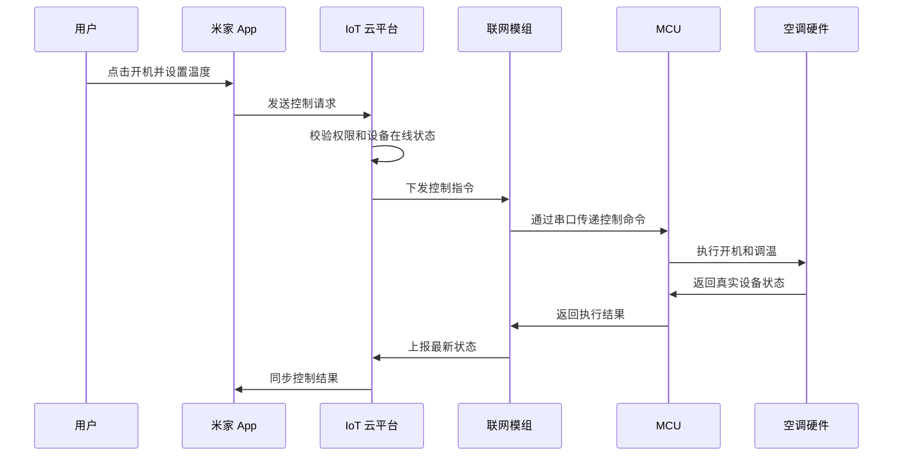
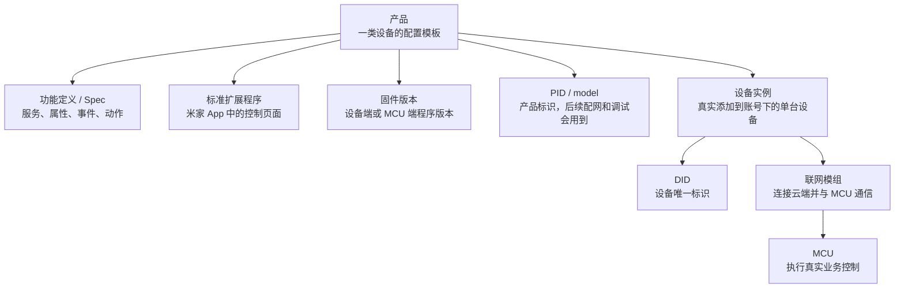

# IoT 核心概念：接入小米 IoT 平台前先理解什么

本文面向准备接入小米 IoT 开发者平台的开发者、产品人员和测试人员。目标不是完整介绍整个 IoT 行业，而是帮助读者在开始创建产品前，先理解后续文档中会反复出现的核心概念、系统链路和角色分工。

本文以消费级智能家居为例，重点说明四件事：

- 智能设备为什么需要接入 IoT 系统。
- 米家 App、IoT 云平台、模组、MCU 和真实设备之间如何协作。
- 产品、设备、Spec、固件版本、PID、DID 等平台概念之间是什么关系。
- 不同角色读完概念后，下一步应该进入哪类文档或流程。

> 适用范围：本文用于建立接入前的概念模型，具体页面入口、字段名称和配置要求以小米 IoT 开发者平台最新文档为准。需要直接操作平台时，请继续阅读[小米 IoT 开发者平台接入指南](./iot-platform-guide.md)。

## 先用智能空调理解 IoT

传统空调主要依赖遥控器或机身按键。用户必须在空调附近，才能开机、关机、调温或切换模式。

接入 IoT 后，空调进入了由设备、网络、云平台和 App 组成的系统，用户可以完成更多远程或自动化操作：

- 快到家前，通过米家 App 提前打开空调。
- 出门后，确认空调是否已经关闭。
- 晚上睡觉时，让空调自动切换到睡眠模式。
- 将设备共享给家人，让不同家庭成员都可以控制。
- 当固件有新版本时，通过 OTA 完成远程升级。

因此，IoT 可以理解为：**把物理设备连接到网络中，让设备可以上报状态、接收指令，并和 App、云平台或其他设备协同工作。**

## 一次远程控制经过哪些环节

从用户角度看，远程打开空调只是“在 App 上点一下”。从系统角度看，这个动作至少经过用户、App、云平台、模组、MCU 和真实硬件。

这条链路里，每个角色负责的问题不同：

| 角色 | 主要职责 | 常见失败表现 |
| --- | --- | --- |
| 米家 App | 展示设备页、发送控制请求、展示状态 | 页面无法进入、控制按钮不可用、状态不刷新 |
| IoT 云平台 | 管理产品、校验权限、转发指令、同步状态 | 设备离线、无权限、指令下发失败 |
| 联网模组 | 负责联网、配网、与平台通信、与 MCU 交换消息 | 配网失败、串口无日志、模组未上线 |
| MCU | 执行业务控制逻辑，例如开关、调温、状态读取 | 指令收到但硬件不动作、返回值异常 |
| 真实设备 | 执行物理动作并产生状态变化 | App 显示成功但设备实际状态不一致 |

理解这条链路后，再看接入指南里的串口日志、`set_properties`、`get_properties`、`properties_changed`、功能测试和 OTA 测试，会更容易判断每一步在验证什么。

## 平台接入里的核心对象关系

在小米 IoT 开发者平台中，开发者不是直接从“单台设备”开始，而是先创建“产品”，再围绕产品配置功能、扩展程序、固件和测试流程。

几个概念之间的关系可以这样理解：

| 概念 | 在接入流程中的作用 | 为什么需要先理解 |
| --- | --- | --- |
| 产品 | 表示一类设备，例如“双键开关”或“空调” | 产品类型、联网方式、配网方式创建后会影响后续配置，部分选择创建后不可修改 |
| 功能定义 / Spec | 描述设备支持哪些服务、属性、事件和动作 | 扩展程序、固件代码、测试用例都会围绕 Spec 生成或校验 |
| 设备 | 按某个产品模板添加到账号下的真实设备 | 联调、测试、DID 查询和状态验证都以真实设备为对象 |
| 模组 | 负责联网、配网和平台通信的硬件模块 | 接入方式、串口日志、固件开发和设备上线都与模组能力有关 |
| MCU | 设备侧微控制器，负责真实业务逻辑 | 平台下发控制指令后，最终需要 MCU 驱动硬件动作并返回结果 |
| 固件版本 | 设备端程序版本，支持开发、测试和 OTA 升级 | 固件信息会影响测试、升级、上线检查和问题排查 |
| PID / model | 产品维度的标识信息 | 后续设备配网、串口配置和调试中可能需要引用 |
| DID | 单台设备的唯一标识 | 联调、日志定位、设备状态排查和测试工具中经常使用 |

## 必须理解和可以后置了解的内容

概念文档不需要一次解释所有底层细节。对准备接入平台的读者来说，可以先区分“必须先理解”和“可以后置了解”。

| 优先级 | 概念 | 建议理解到什么程度 |
| --- | --- | --- |
| 必须先理解 | 产品、品类、联网方式、配网方式 | 能判断当前设备应该创建成哪类产品，以及选择哪种接入方式 |
| 必须先理解 | Spec、服务、属性、事件、动作 | 能看懂功能定义页面和后续 `set_properties`、`get_properties` 等消息 |
| 必须先理解 | 模组、MCU、固件、OTA | 能理解为什么需要串口环境、固件设置、功能测试和 OTA 测试 |
| 必须先理解 | PID、model、DID | 能在平台页面、日志和测试工具之间对应产品和设备 |
| 可以后置了解 | 自动化、场景联动、小爱语控 | 接入基础流程跑通后，再根据产品能力补充 |
| 可以后置了解 | 量产、认证、运营数据 | 开发联调完成后，再进入上线和运营阶段深入理解 |

## 根据角色选择下一步

同一份 IoT 文档会被不同角色阅读。读者可以先根据自己的角色判断下一步要进入哪类内容。

| 读者角色 | 当前最需要解决的问题 | 建议下一步 |
| --- | --- | --- |
| 产品经理或设备厂商 | 确认产品品类、联网方式、配网方式和上线范围 | 阅读[小米 IoT 开发者平台接入指南](./iot-platform-guide.md)的前提条件、产品创建和基础配置部分 |
| 嵌入式或固件开发者 | 理解模组、MCU、Spec 消息和固件开发关系 | 阅读接入指南中的固件设置、串口环境、代码生成和 Spec 功能实现部分 |
| 测试人员 | 确认功能测试、耗时测试、OTA 测试和上线自测要求 | 阅读接入指南中的固件测试、产品联调、自测和申请上线部分 |
| 后端或函数计算开发者 | 确认云端接口如何控制设备、存储数据或查询状态 | 阅读[IoT 平台函数计算 API 文档](./api-docs.md) |
| 技术文档工程师 | 了解概念页、操作指南、API 文档之间如何衔接 | 先读本文，再对照接入指南检查术语、前提条件和下一步链接是否一致 |

## 开发前的判断清单

进入具体接入步骤前，建议先确认下面几个问题。只要其中一项不清楚，后续操作就可能在创建产品、配网、联调或测试阶段卡住。

| 判断问题 | 如果答案是“否” | 如果答案是“是” |
| --- | --- | --- |
| 是否已经具备企业组、企业开发者和产品配置权限？ | 先完成账号、企业组和权限准备 | 继续确认产品品类和接入方式 |
| 产品是否属于平台开放接入的品类？ | 先确认品类是否支持接入米家 App 和小爱同学 | 继续选择联网方式和配网方式 |
| 是否已经明确使用哪种模组和开发方式？ | 先确认模组选型、开发板、串口工具和驱动 | 进入固件设置和串口环境准备 |
| 是否已经理解产品功能应该如何映射到 Spec？ | 先阅读 Spec 知识和标准产品方案 | 进入功能定义、扩展程序和固件实现 |
| 是否已经准备真实设备或开发板进行联调？ | 先准备硬件、测试账号和米家 App 环境 | 进入配网、控制、状态上报和测试流程 |

## 常见术语表

| 术语 | 含义 |
| --- | --- |
| IoT | 让物理设备接入网络，并具备状态上报、远程控制和管理能力 |
| 智能设备 | 接入 IoT 系统的设备，例如空调、灯、插座、传感器 |
| 米家 App | 用户添加、控制和管理智能家居设备的入口 |
| IoT 云平台 | 负责产品管理、权限校验、指令转发、状态同步和测试上线的平台能力 |
| 产品 | 平台中描述一类设备的配置模板，后续功能定义、扩展程序、固件和测试都围绕产品展开 |
| Spec | 设备能力的标准化描述，通常包含服务、属性、事件和动作 |
| 配网 | 让设备连接网络，并进入可被 App 添加或绑定的状态 |
| 模组 | 帮助设备实现联网、配网和平台通信的硬件模块 |
| MCU | 设备中的微控制器，通常负责具体业务控制逻辑 |
| 固件 | 运行在设备端、模组或 MCU 中的程序 |
| OTA | 通过网络远程升级设备固件 |
| PID / model | 产品维度的标识信息，后续配网、串口配置或调试中可能使用 |
| DID | 单台设备的唯一标识，用于联调、日志排查和测试工具定位设备 |
| 状态上报 | 设备把当前状态同步给平台或 App |
| 指令下发 | 平台或 App 向设备发送控制命令 |

## 下一步

- 如果需要开始创建产品、配置功能定义并完成联调，请阅读[小米 IoT 开发者平台接入指南](./iot-platform-guide.md)。
- 如果需要查看函数计算中可调用的平台接口，请阅读[IoT 平台函数计算 API 文档](./api-docs.md)。
- 如果只想快速建立概念，可以先重点阅读“平台接入里的核心对象关系”和“开发前的判断清单”两节。

概念解释的价值不只是让读者知道名词含义，而是帮助读者判断自己处在接入流程的哪个阶段、缺少哪些前提条件，以及下一步应该进入哪份文档。
