---
sidebar_position: 4
---

# 小米 IoT 开发者平台接入指南

本文以“双键开关”为例，介绍使用 Wi-Fi 通用模组接入米家平台的必填配置和验证流程。开发者需按本文完成产品创建、基础配置、功能定义、扩展程序、固件开发、产品联调、高阶配置、自测和上线申请。

> 信息有效性说明：本文中的平台入口、工具名称、测试清单和截图位置可能随平台版本变化。实际操作时，请以小米 IoT 开发者平台最新页面、工具下载入口和测试要求为准；截图仅用于说明关键入口位置，关键字段和预期结果均在正文中补充说明。

## 前提条件

1. 已登录[小米 IoT 开发者平台](https://iot.mi.com/fe-op/productCenter)。
2. 已注册企业组，详情请参考 [注册企业组](https://iot.mi.com/v2/new/doc/configuration/signin/create-enterprise#创建新企业组)。
3. 已成为企业开发者，详情请参考 [企业成员管理](https://iot.mi.com/v2/new/doc/configuration/permission/manage-member)。
4. 已获得产品配置权限，详情请参考 [权限说明](https://iot.mi.com/v2/new/doc/configuration/permission/manage-member#权限说明)。
5. 已了解平台基础概念，包括 [Spec 知识](https://iot.mi.com/v2/new/doc/introduction/knowledge/spec)、[UID](https://iot.mi.com/v2/new/doc/introduction/knowledge/explanation#UID)、[DID](https://iot.mi.com/v2/new/doc/introduction/knowledge/explanation#DID)、[Model](https://iot.mi.com/v2/new/doc/introduction/knowledge/explanation#Model) 和 [PID](https://iot.mi.com/v2/new/doc/introduction/knowledge/explanation#PID)。
6. 已准备 USB 转串口模块、MHCWB5G Test Board 开发板和 MHCWB5G-B 模组。模组和开发板样品可在[模组采购](https://iot.mi.com/fe-op/manageCenter/purchase/module)中申请。
7. 已安装串口终端工具，如 [MobaXterm](https://mobaxterm.mobatek.net/)，用于查看模组 log。
8. 已安装串口调试助手，用于收发串口指令。
9. 已安装 CH340 驱动和 USB 转串口模块对应驱动，确保电脑可识别开发板和串口模块的 COM 口。

## 操作步骤

开发者需根据平台已开放的[接入品类说明](https://iot.mi.com/v2/new/doc/introduction/preparation/product_type#%E5%BC%80%E6%94%BE%E6%8E%A5%E5%85%A5%E4%BA%A7%E5%93%81%E7%B1%BB%E5%9E%8B)和[模组选型页面](https://iot.mi.com/moduleBrowser.html)，结合产品特点选择模组和开发方式。开放品类、模组型号和工具入口请以平台最新页面为准。本示例选型如下。

| 配置项 | 本示例选型 |
| --- | --- |
| 产品品类 | 双键开关 |
| 接入方式 | 选用小米 IoT 模组直接接入 |
| 联网方式 | Wi-Fi + BLE |
| 模组选型 | BL602 芯片平台的 MHCWB5G-B 模组 |
| 开发方式 | 通用模组 + MCU |

### 第 1 步 - 创建产品

1. 进入[产品管理](https://iot.mi.com/fe-op/productCenter)，在“新产品接入米家 App 和小爱同学”栏中点击【新建产品】。

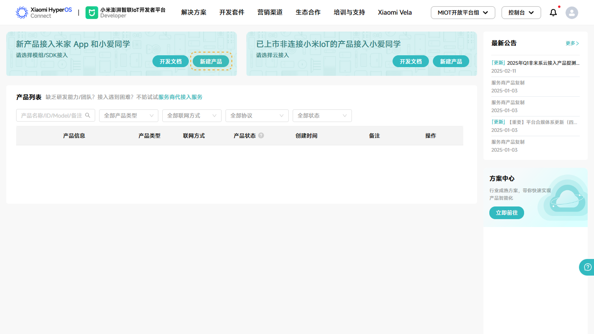

2. 在弹窗中依次填写产品类型、联网方式、配网方式、产品名称、产品型号和品牌名称。具体填写要求请参考 [创建产品信息填写要求](https://iot.mi.com/v2/new/doc/configuration/create#%E7%AC%AC%202%20%E6%AD%A5%20-%20%E5%A1%AB%E5%86%99%E4%BA%A7%E5%93%81%E4%BF%A1%E6%81%AF)。
3. 确认“产品类型”和“联网方式”选择正确。两项创建后不可修改。“联网方式”和“配网方式”的对应关系，请参考 [不同联网方式和配网方式对应关系](https://iot.mi.com/v2/new/doc/configuration/configuration#后续操作)。
4. 点击【确定】，完成产品创建。

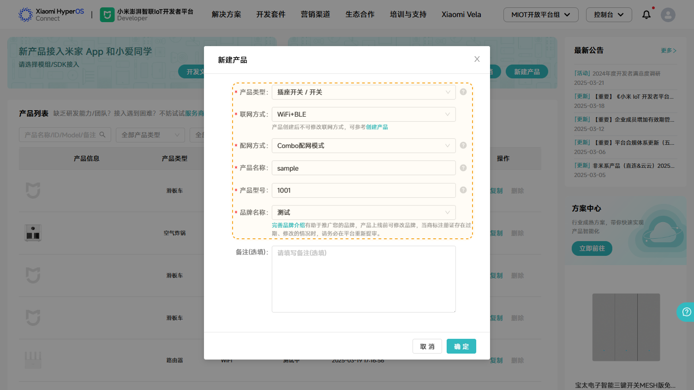

5. 在产品列表中点击已创建的产品，进入产品基础配置页面。
6. 记录页面左上角的 `model` 和 `pid`，后续设备配网和串口配置需要使用。

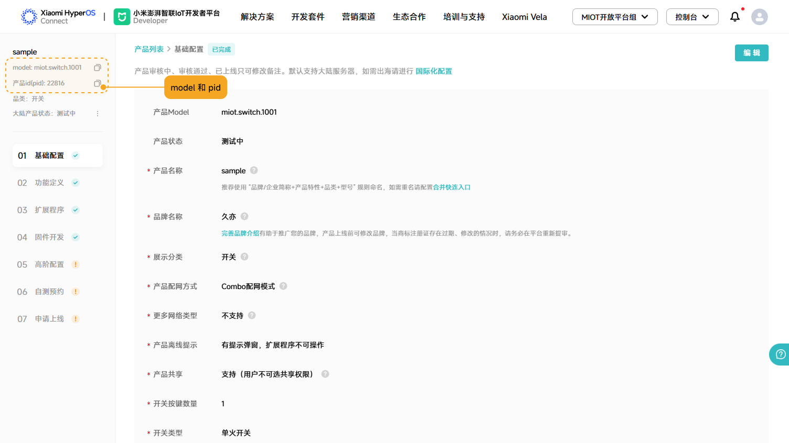

**预期结果**：产品详情页可正常打开，页面左上角能看到 `model` 和 `pid`。

**常见问题**：

- 产品类型、联网方式或配网方式选错：这些字段创建后通常不可修改，建议停止后续配置，重新创建产品并确认选项后再继续。
- 找不到已创建产品：确认当前账号是否在目标企业组下，并检查账号是否具备产品配置权限。
- 页面入口或字段名称变化：以平台最新页面为准，但后续流程仍需记录产品维度的 `model` 和 `pid`。

### 第 2 步 - 完成基础配置

1. 在左侧主流程中点击【基础配置】。
2. 在基础功能配置页面点击【编辑】。
3. 按产品实际情况填写配网方式、产品图标等必填信息，具体要求请参考 [基础配置页面填写要求](https://iot.mi.com/v2/new/doc/configuration/configuration)。
4. 点击【保存】，完成基础配置。

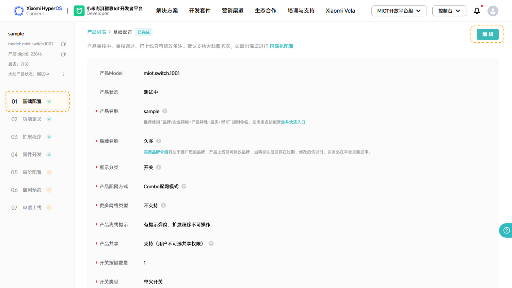

**预期结果**：基础配置页不再提示必填项缺失，左侧主流程中的基础配置节点显示已完成或可继续进入下一步。

### 第 3 步 - 完成功能定义

1. 在左侧主流程中点击【功能定义】，进入选择产品方案页面。
2. 根据产品功能特性，选择标准产品方案【双键开关（左右结构）】。
3. 点击【确定】，进入功能定义编辑阶段。

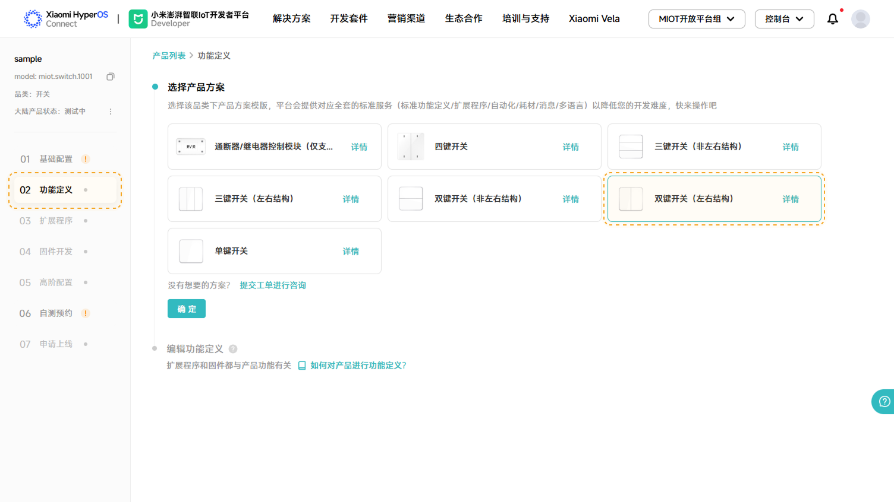

4. 检查平台自动列出的标准服务，确保功能定义与产品实际能力一致。开关品类标准服务请参考 [开关品类模板](https://iot.mi.com/v2/new/doc/introduction/solution/standard/category/switch)。

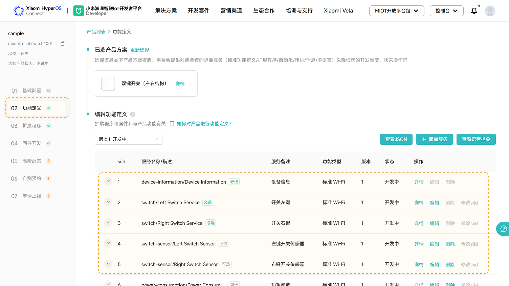

5. 确认功能定义保存成功。后续扩展程序、固件代码和测试用例均以该 Spec 为准。

**常见问题**：

- 标准产品方案与真实设备能力不一致：先确认是否选错品类或方案。若设备能力无法匹配标准方案，需要在继续开发前与产品或平台支持确认是否允许调整功能定义。
- Spec 修改后扩展程序或测试用例不一致：以最新保存的功能定义为准，重新检查扩展程序版本、代码生成结果和默认测试用例。

### 第 4 步 - 开启标准扩展程序测试

1. 在左侧主流程中点击【扩展程序】。
2. 检查扩展程序版本列表。
3. 已默认生成标准扩展程序版本时，点击操作栏中的【开启测试】。

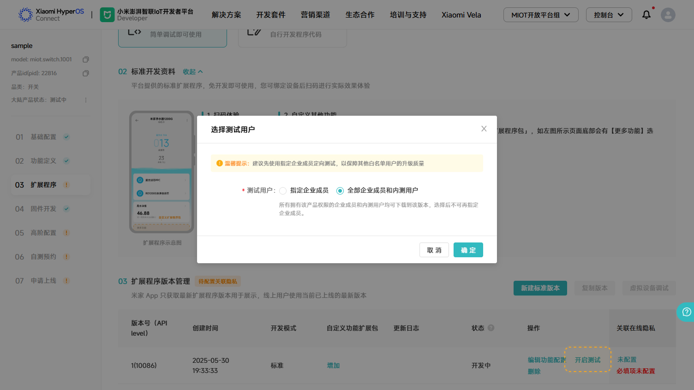

4. 未自动生成标准扩展程序版本时，点击【新建标准版本】，按页面提示配置必选项。本示例为开关品类，配置如下。

| 配置项 | 本示例选择 | 选择说明 |
| --- | --- | --- |
| 定时类型 | 定时 2.0 | 用于支持开关类设备的定时控制能力；若产品不需要定时能力或平台选项变化，应以当前品类模板和平台推荐项为准 |

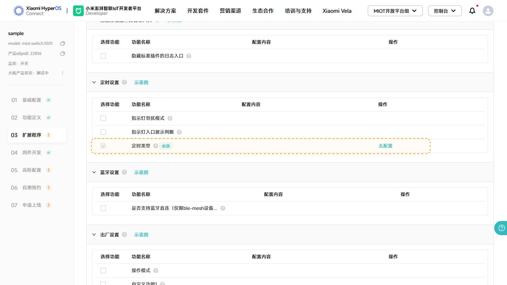

5. 点击【开启测试】，选择全部企业成员和内测账号。
6. 点击【确定】，完成标准扩展程序测试开启。
7. 使用具有白名单权限的账号登录米家 App，通过添加设备入口完成设备添加。
8. 点击绑定后的设备宫格，确认可以进入标准扩展程序页面。

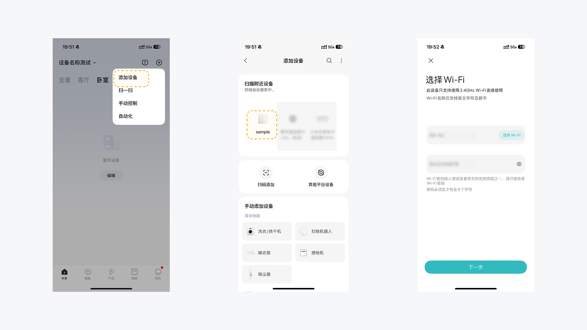

**预期结果**：测试账号能在米家 App 中添加设备，并进入标准扩展程序页面。

**常见问题**：

- 看不到测试设备：确认当前账号已加入测试白名单，并使用同一企业或项目下的账号登录米家 App。
- 扩展程序无法开启测试：确认功能定义已保存、必选配置项已填写，并检查是否存在未发布或未保存的扩展程序版本。
- 标准扩展程序页面无法进入：先确认设备已完成配网，再检查扩展程序测试范围是否包含当前账号。

### 第 5 步 - 完成固件设置

1. 在左侧主流程中点击【固件开发】。
2. 在固件设置区域点击【编辑】。
3. 按以下内容配置固件信息。

| 配置项 | 必填值 |
| --- | --- |
| 操作系统 | RTOS |
| 开发模式 | 小米标准模组 + MCU |
| OTA 方式 | MCU 固件 OTA（推荐） |
| 安全芯片 | 未使用 |
| 模组型号 | MHCWB5G-B |

4. 点击【确定】，完成固件设置。

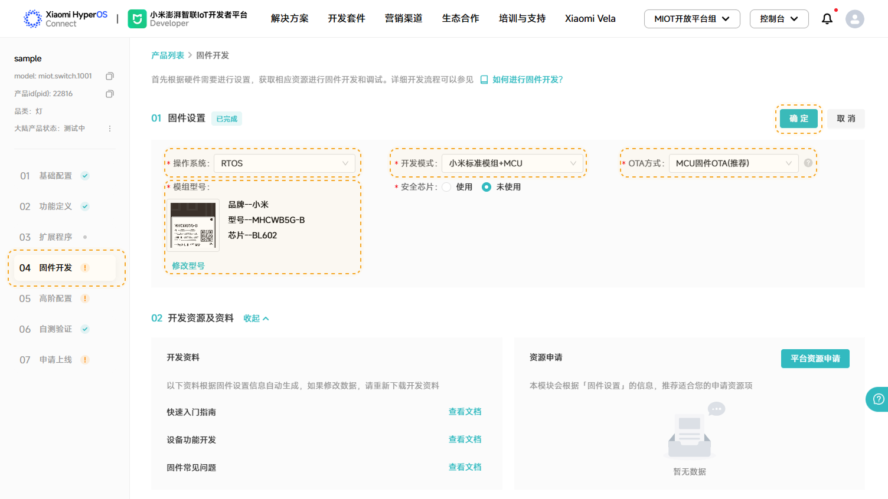

### 第 6 步 - 搭建串口环境

通用模组自带小米 IoT 固件，开发者通常无需烧录模组固件。本步骤只验证两条串口链路：电脑到模组日志串口、电脑到 MCU 通讯串口。

1. 打开 MHCWB5G-B 模组规格书和开发资料，确认原理图、管脚描述、上电时序要求和物理尺寸。资料可在[模组选型页面](https://iot.mi.com/moduleBrowser.html)查找并下载，具体型号和资料版本以平台最新页面为准。

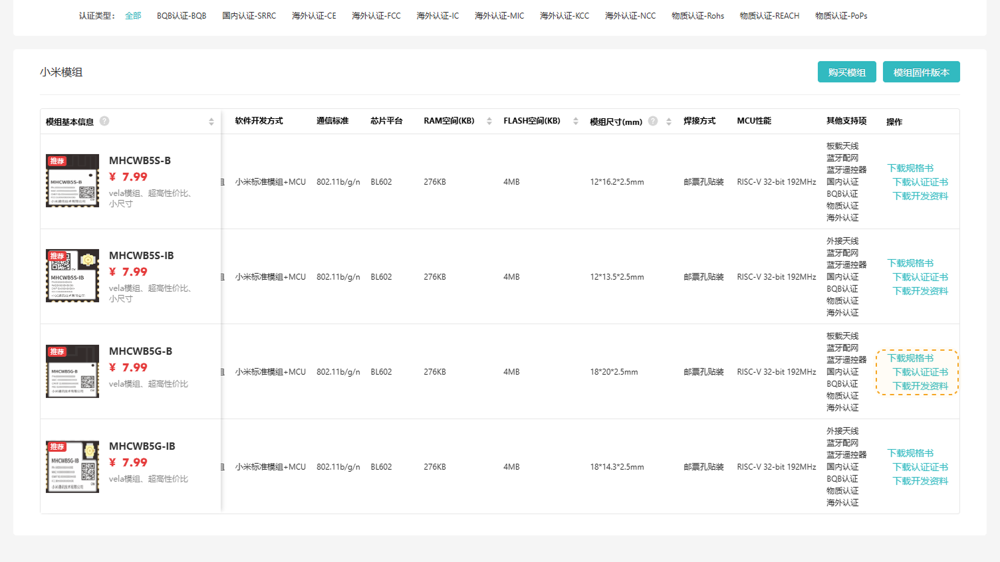
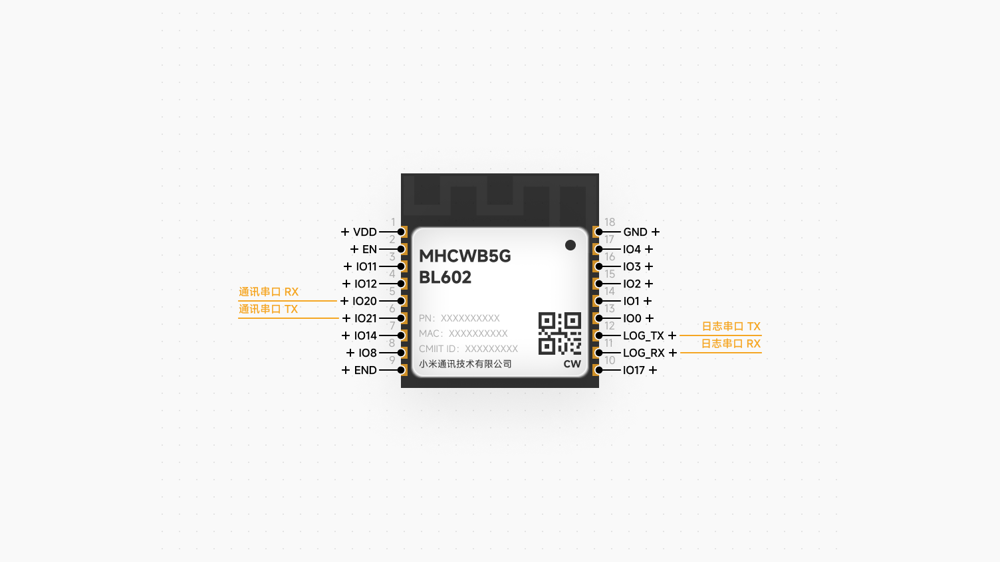

2. 将 MHCWB5G Test Board 开发板连接电脑 USB 口，在设备管理器中记录开发板对应的 COM 编号。
3. 在串口终端工具中点击【Session】，终端类型选择【Serial】，并按以下参数打开对应 COM 口。

| 串口参数 | 参数值 |
| --- | --- |
| 波特率 | 115200 |
| 数据位 | 8 |
| 停止位 | 1 |
| 校验位 | 无 |
| 流控 | 无 |

4. 短按开发板 CHIP_EN 按钮。串口终端工具输出系统启动日志时，表示开发板日志串口连接成功。

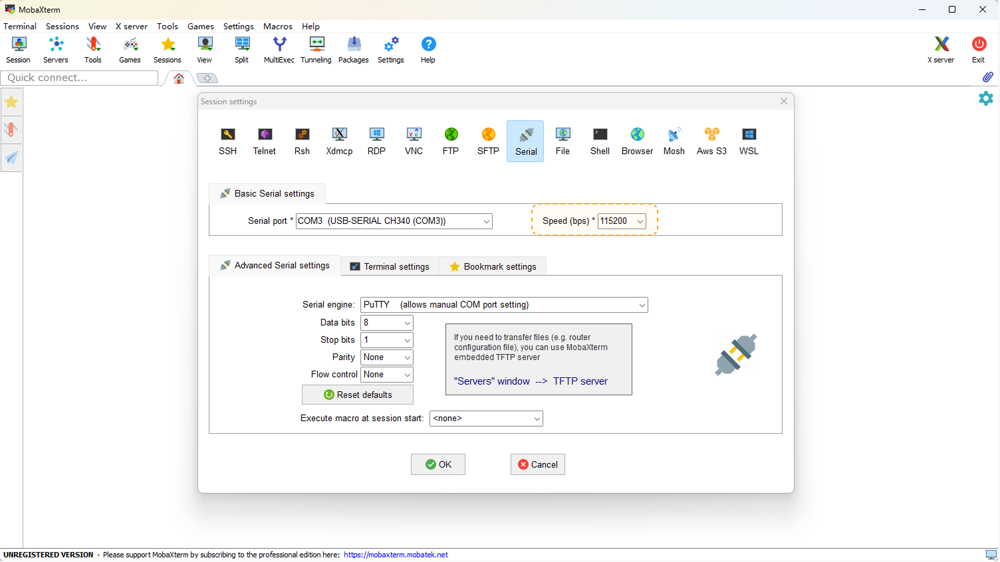

5. 将 USB 转串口模块 TX 连接开发板通讯串口 GPIO20。
6. 将 USB 转串口模块 RX 连接开发板通讯串口 GPIO21。
7. 将 USB 转串口模块 GND 连接开发板 GND。
8. 将 USB 转串口模块连接电脑 USB 口，记录对应 COM 编号。
9. 在串口调试助手中按 115200、8、1、无校验、无流控打开对应 COM 口。
10. 发送 `get_down` 指令，模组回复 `down xxxx` 时，表示 MCU 通讯串口连接成功。

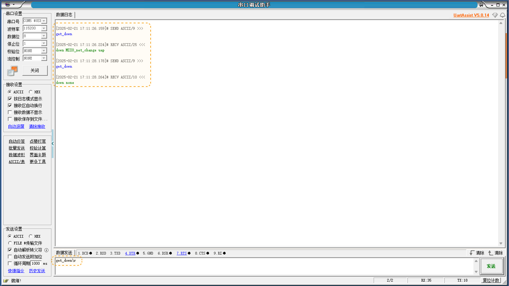

**预期结果**：日志串口能看到模组启动日志，通讯串口发送 `get_down` 后能收到 `down_none` 或 `down xxxx` 回复。

**常见问题**：

- 电脑识别不到 COM 口：检查 CH340 驱动、USB 线和开发板供电。
- 串口无日志：确认波特率为 `115200`，并检查 CHIP_EN 按钮、TX/RX 接线和 GND 是否共地。
- `get_down` 无回复：优先检查通讯串口 TX/RX 是否接反，再确认串口调试助手连接的是通讯串口而非日志串口。

### 第 7 步 - 写入设备信息并完成配网

1. 通过串口指令配置模组的 `model`、`pid`、`mcu_version` 和 `log_level`。需将命令中的示例值替换为产品实际信息。

| 指令功能 | MCU 发送 | 模组回复 | 指令说明 |
| --- | --- | --- | --- |
| 获取模组下行指令 | `get_down` | `down_none` | 返回模组下行指令，没有下行指令时返回 `down_none` |
| 设置 log 打印 | `set_log_level 0` | `ok` | `0` 代表 log 打印等级为 debug |
| 设置 model | `model xxx.xxx.xxx` | `ok` | `xxx.xxx.xxx` 为产品基础信息中的设备 model |
| 设置 PID | `ble_config set xxxxx 0001` | `ok` | `xxxxx` 为产品基础信息中的设备 PID |
| 设置 mcu version | `mcu_version 0001` | `ok` | `0001` 为 MCU 固件版本 |

2. 具体命令格式请参考 [串口通讯协议](https://iot.mi.com/v2/new/doc/embedded-dev/module-dev/function-dev/serial-communication)。

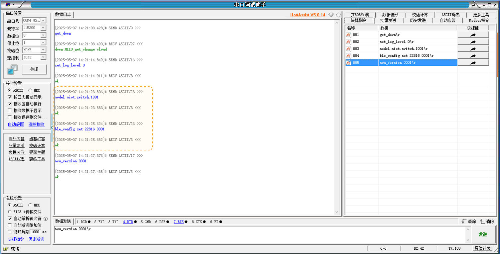

3. 重启模组，在串口终端工具中确认日志包含刚配置的 `model` 和 `mcu_version`。
4. 使用[具有本企业开发者权限的账号](https://iot.mi.com/v2/new/doc/configuration/signin#加入已有企业组)登录米家 App。
5. 添加设备并选择 `sample` 进行配网，使模组连接云端。米家 App 无法发现设备时，请参考 [米家 App 无法找到设备](https://iot.mi.com/v2/new/doc/embedded-dev/module-dev/mcu-faq#米家%20App%20无法找到设备)。

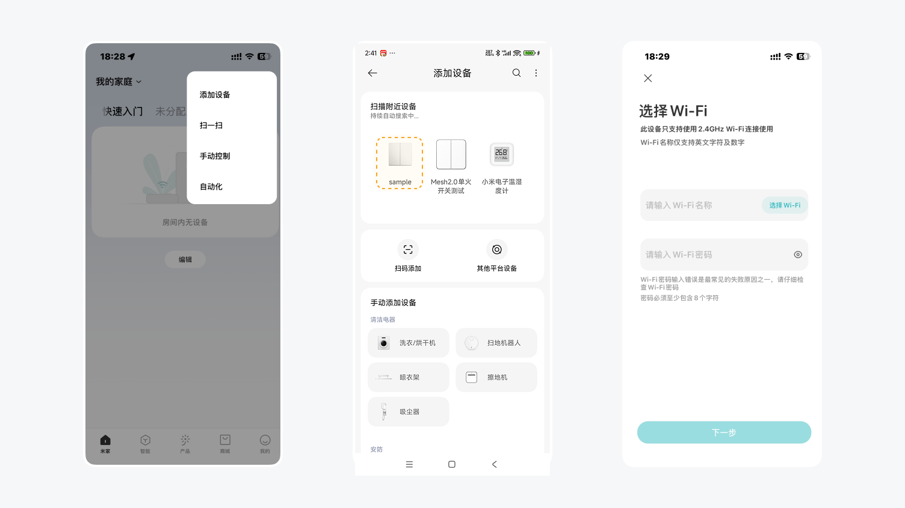

6. 配网成功后，设置设备房间和名称，进入扩展程序页面。

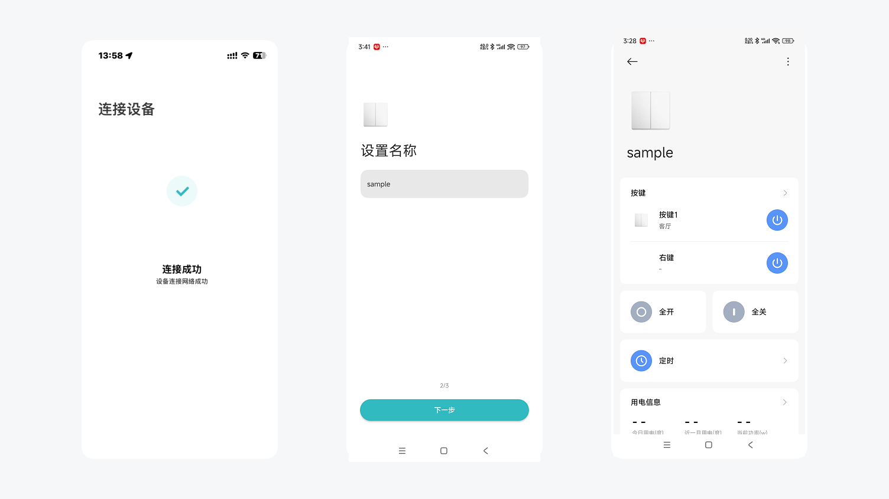

**预期结果**：米家 App 中出现已添加设备，串口日志中能看到设备上线或连接成功相关日志。

**常见问题**：

- App 无法发现设备：确认 `model`、`pid` 写入正确，设备处于可配网状态，并检查手机蓝牙、Wi-Fi 和定位权限。
- 配网后设备离线：检查路由器网络、模组供电和模组日志，确认设备是否成功连接云端。
- 设备信息写入后仍不生效：重启模组后重新查看日志，确认 `model` 和 `mcu_version` 已按实际产品信息加载。

### 第 8 步 - 生成 MCU 代码

1. 在工具箱中点击【Spec 固件代码自动生成工具】，进入 Spec 固件代码生成页面。

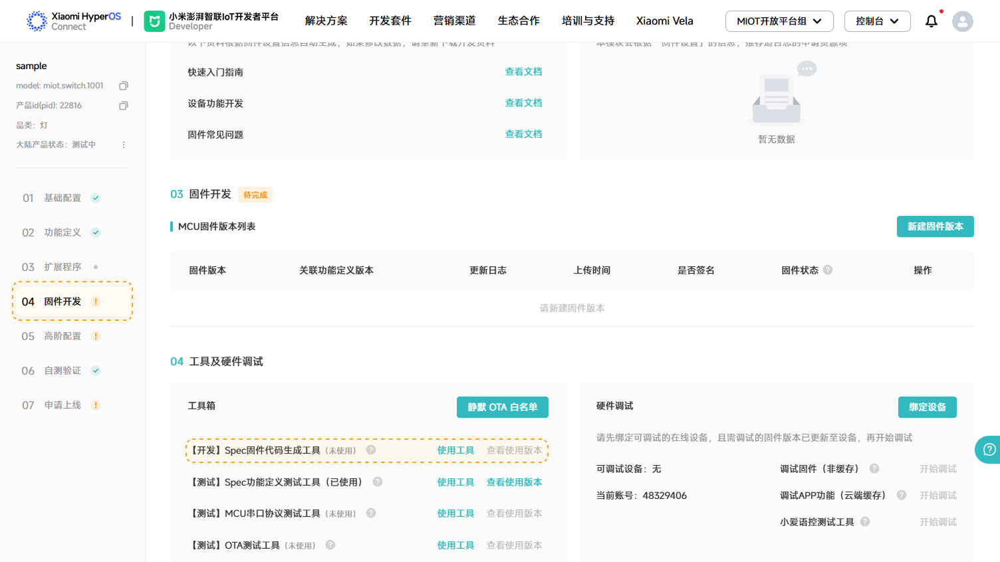

2. 选择设备类型后，点击【生成源代码】。
3. 在弹窗中点击【确定】。

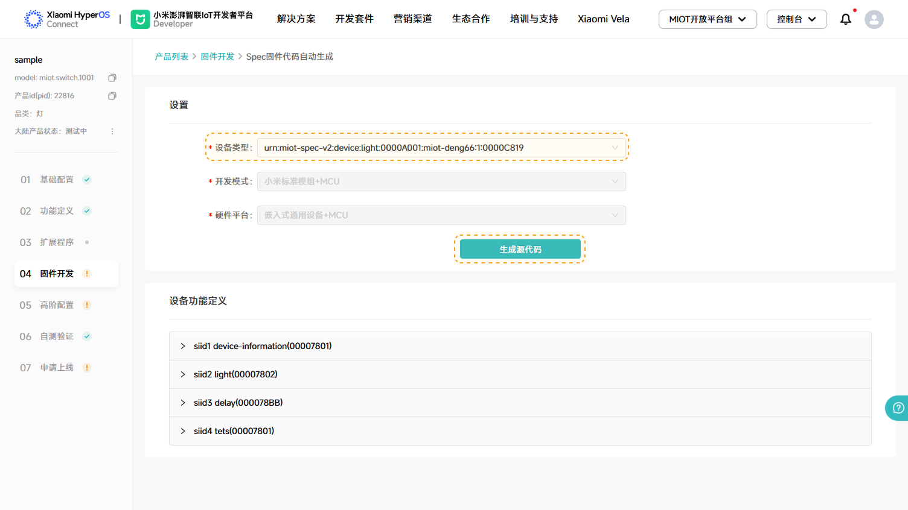

4. 源码生成后，点击【设备源代码已经生成，点击下载】，获取 MCU 代码并解压。
5. 确认解压后的代码包含以下目录和文件。

| 目录或文件 | 说明 |
| --- | --- |
| `MCU_Demo二次开发手册v1.5.pdf` | MCU Demo 开发手册 |
| `README.md` | MCU Demo 开发说明 |
| `arch` | 需适配硬件平台的接口函数 |
| `miio` | 小米相关代码目录 |
| `tools/crc` | MCU 固件上传云端前使用的 CRC 校验工具 |
| `user` | 用户实现 Spec 产品功能的目录 |

### 第 9 步 - 实现 Spec 功能

平台生成的 MCU Demo 代码只包含框架，未实现具体产品功能。开发者需根据功能定义实现产品能力，并完成以下必需消息处理。

#### set_properties

`set_properties` 的下行流程为：米家扩展程序 → 云端 → 模组 → MCU。MCU 收到控制指令后，需完成以下处理：

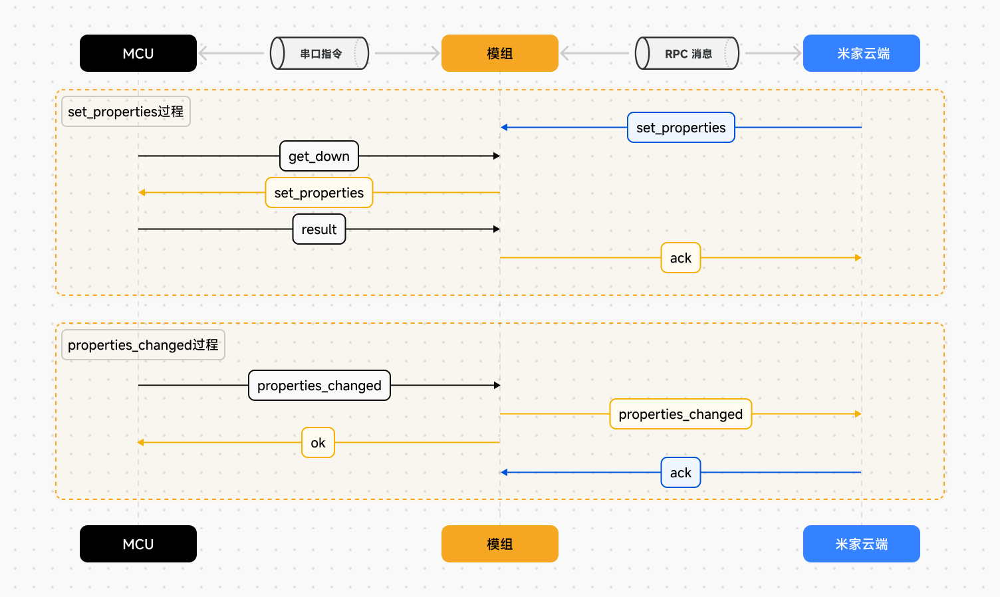

1. 校验属性值格式。
2. 执行真实设备控制，例如控制开关状态。
3. 返回执行结果。
4. 控制成功后，上报属性变化，通知 App 刷新设备状态。

以 `siid:2`、`piid:1` 为例，开关控制时 MCU 需响应 `set_properties 2 1 true`，并在 4s 内回复 `result 2 1 0`。

#### get_properties

`get_properties` 的下行流程为：米家扩展程序 → 云端 → 模组 → MCU。MCU 收到状态查询后，需完成以下处理：

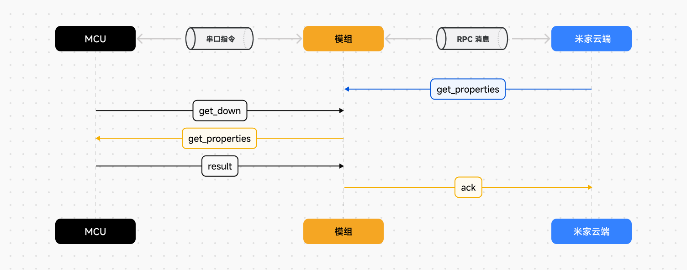

1. 读取设备真实状态。
2. 按 Spec 格式返回属性值。

以 `siid:2`、`piid:1` 为例，查询开关状态时 MCU 需响应 `get_properties 2 1`，并在 4s 内回复 `result 2 1 0 true` 或实际状态值。

#### properties_changed

`properties_changed` 的上行流程为：MCU → 模组 → 云端 → 米家扩展程序。设备状态变化后，MCU 需主动上报属性变化，保证云端和 App 状态同步。

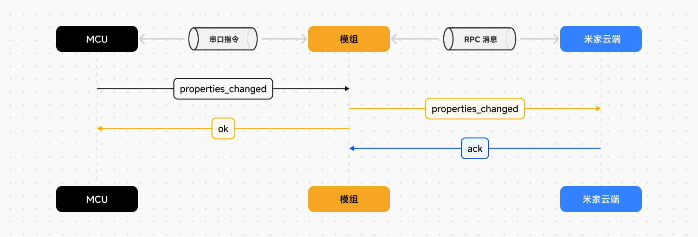

以 `siid:2`、`piid:1` 为例，设备成功执行开关控制后，MCU 需通过 `properties_changed 2 1 true` 上报当前状态。

**实现完成检查**：

| 检查项 | 通过标准 |
| --- | --- |
| 控制指令 | MCU 收到 `set_properties` 后，真实硬件状态发生对应变化 |
| 执行结果 | MCU 在 4s 内返回 `result 2 1 0`，失败时返回可排查的错误结果 |
| 状态查询 | MCU 收到 `get_properties` 后，返回真实硬件当前状态，而不是固定示例值 |
| 状态上报 | 硬件状态变化后，MCU 主动发送 `properties_changed`，App 页面状态能同步刷新 |

**常见问题**：如果串口日志显示指令已下发，但硬件没有动作，需要先排查 MCU 业务逻辑、GPIO 或继电器控制链路；如果硬件已动作但 App 状态不刷新，需要检查 `properties_changed` 是否上报，以及上报值是否与 Spec 定义一致。

### 第 10 步 - 完成 OTA 开发并上传固件

本步骤的目标是把可升级的 MCU 固件版本上传到平台，供后续调试和测试使用；第 11 步和第 12 步中的 OTA 测试用于验证升级流程是否稳定。

1. 按平台要求完成 [OTA](https://iot.mi.com/v2/new/doc/configuration/firmware/firmware#概念说明) 开发。MCU OTA 开发流程请参考 [MCU OTA 升级开发](https://iot.mi.com/v2/new/doc/embedded-dev/module-dev/ota/mcu-ota)。
2. 进入【固件开发】页面。
3. 点击【新建固件版本】。

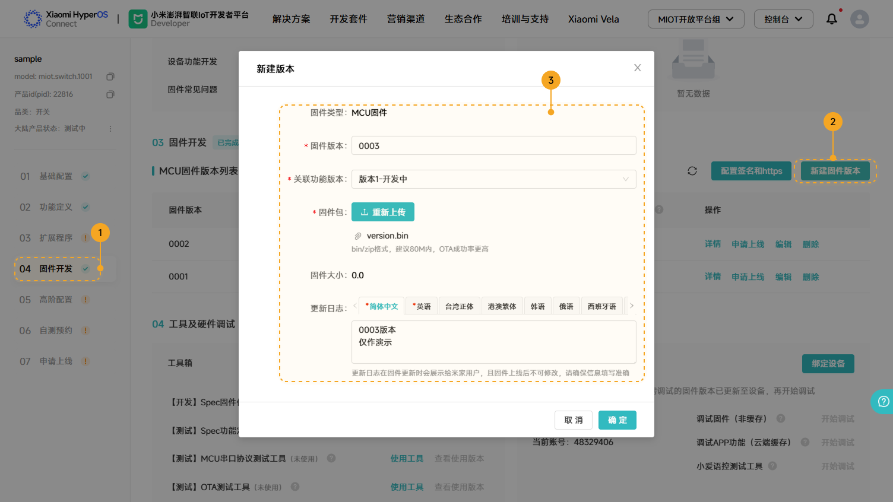

4. 按页面要求上传固件并填写版本信息。
5. 保存固件版本，用于后续升级调试和测试。

**预期结果**：固件版本列表中出现新上传版本，版本号、升级包和适用产品信息与当前测试设备一致。

**常见问题**：

- 固件上传失败：检查固件包格式、大小、版本号和 CRC 校验结果是否符合平台要求。
- App 不展示升级提示：确认测试设备绑定账号、当前设备版本和平台中配置的目标升级版本是否匹配。
- 版本信息填错：不要继续进入联调，先修正或重新创建固件版本，避免后续 OTA 测试结果失真。

### 第 11 步 - 完成固件测试

固件开发完成后，需使用 [AIoT 测试工具](https://autotest.iot.mi.com/acsLanding/)完成 Spec 功能测试、耗时测试和 OTA 测试。测试工具入口、工具版本和默认用例集可能更新，请以平台最新工具为准。

本步骤中的 OTA 测试用于确认升级流程能跑通；第 12 步中的 OTA 压力测试用于验证多次升降级场景下的稳定性。

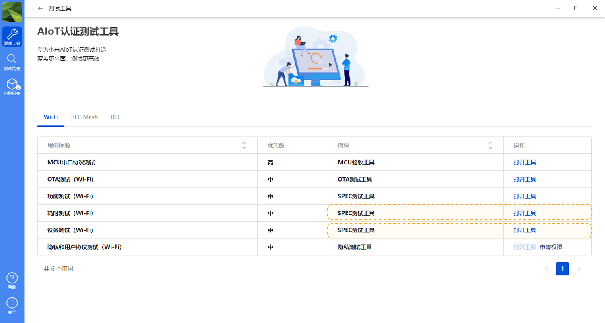

1. 下载并安装 AIoT 测试工具。
2. 在工具主页的“设备”栏中确认当前 UID 下的在线设备。
3. 在“功能测试”下点击【开始】。
4. 在弹窗中选择“默认测试用例集”，点击【确认】。
5. 确认生成的默认测试用例集符合 Spec 定义要求。
6. 滚动到页面底部，点击左侧【开始】启动功能测试。

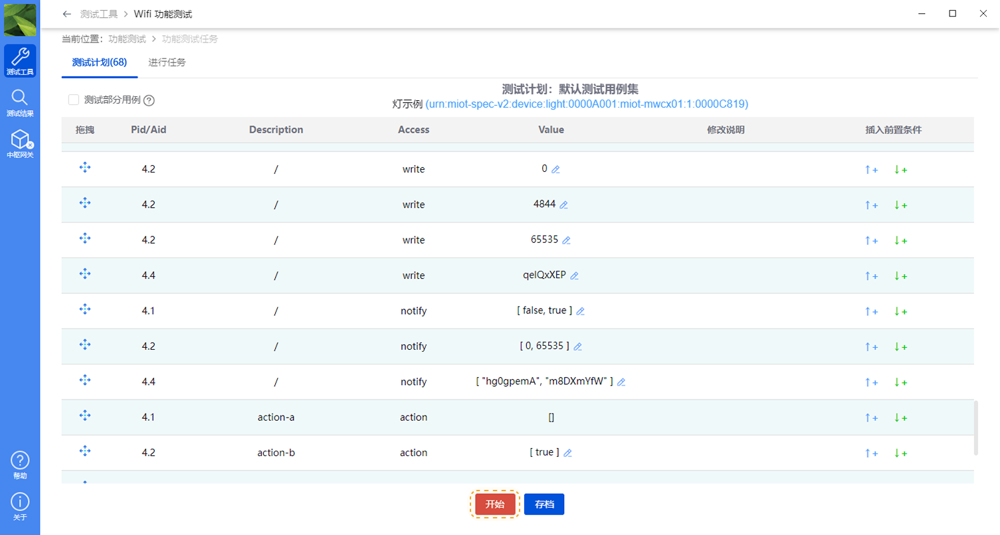

7. 确认功能测试用例全部通过。

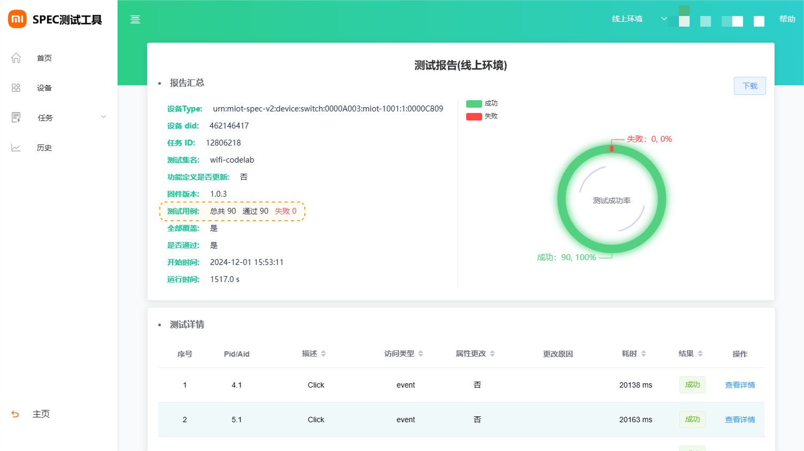

8. 在“耗时测试”下点击【开始】。
9. 在弹窗中选择“默认测试用例集”，点击【确认】。
10. 确认生成的默认测试用例集符合 Spec 定义要求。
11. 滚动到页面底部，点击左侧【开始】启动耗时测试。

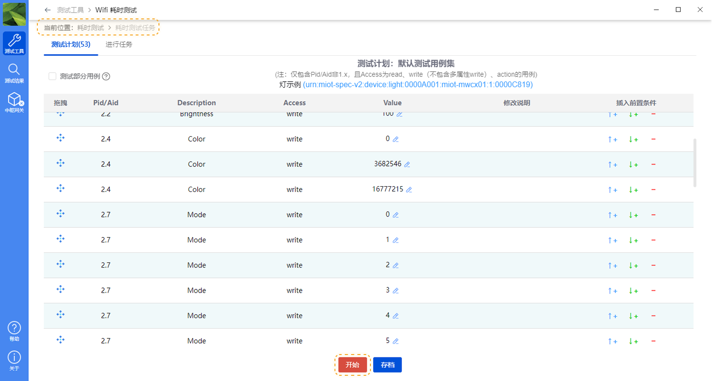

12. 确认耗时测试用例全部通过。

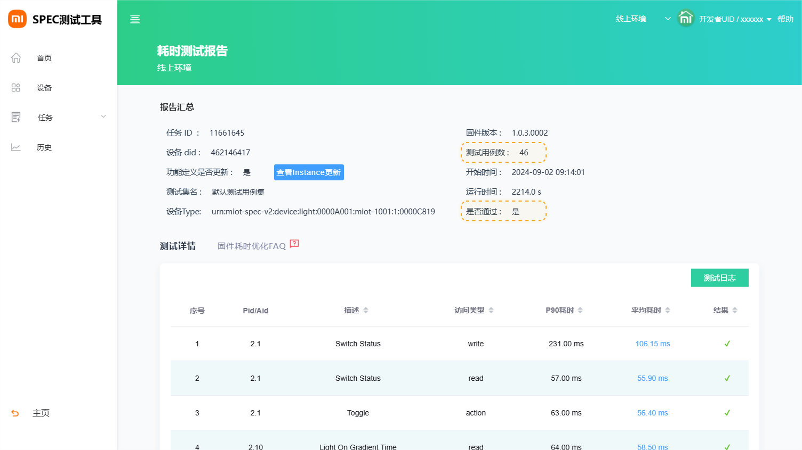

13. 打开 AIoT 测试工具。
14. 依次选择 Wi-Fi → OTA 测试 (Wi-Fi) → 打开工具。

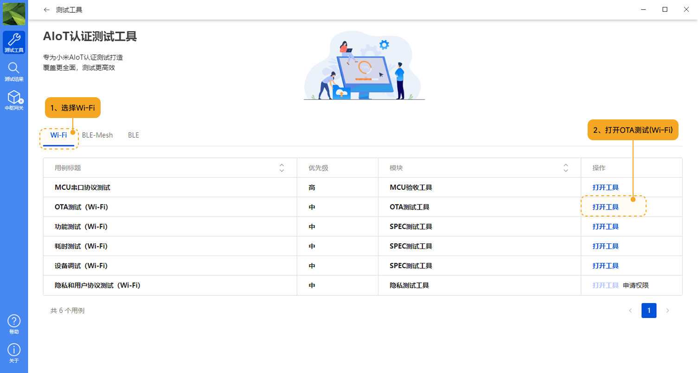

15. 选择线上环境、待测设备和对应升降级版本。
16. 启动 OTA 测试，确认 OTA 调试流程可正常完成。

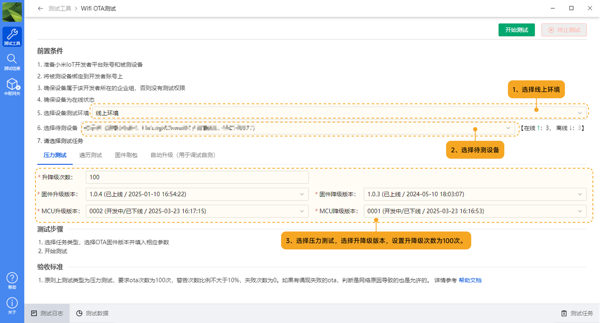

### 第 12 步 - 完成产品联调

1. 使用具有本企业开发者权限的账号登录米家 App。
2. 添加设备并选择 `sample` 进行配网，使模组连接云端。
3. 配网成功后，设置设备房间和名称。
4. 点击设备宫格，确认能进入扩展程序页面。
5. 在扩展程序中点击开关图标。

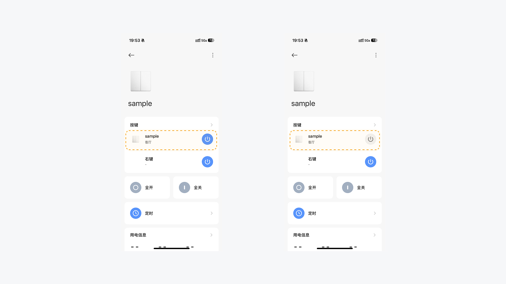

6. 确认扩展程序下发控制指令后，模组向 MCU 发送 `set_properties 2 1 true`。
7. 确认 MCU 在 4s 内回复 `result 2 1 0`。
8. 确认设备执行真实开关动作。
9. 确认 MCU 通过 `properties_changed 2 1 true` 上报当前状态。

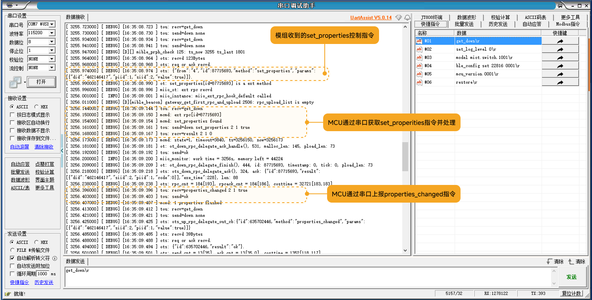

10. 打开设备扩展程序，确认模组向 MCU 发送 `get_properties 2 1`。
11. 确认 MCU 在 4s 内回复 `result 2 1 0 true` 或实际状态值。
12. 确认 App 展示状态与设备真实状态一致。

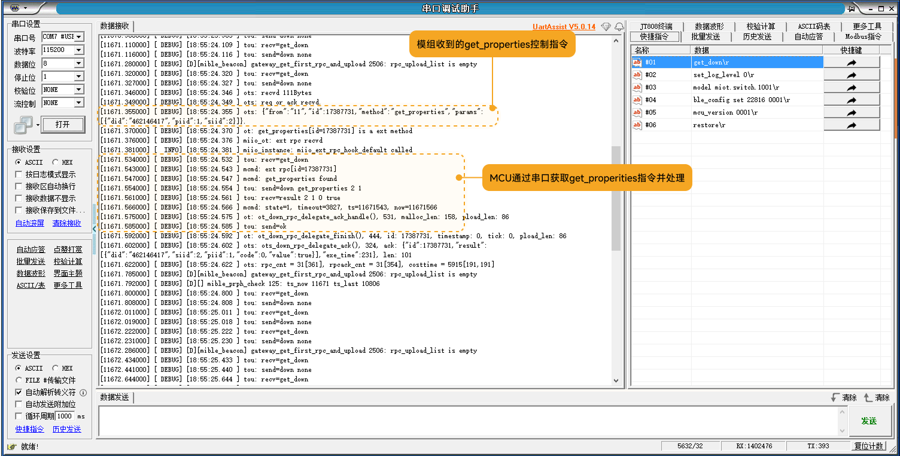

13. 在平台产品的【固件开发】页面进入硬件调试栏。

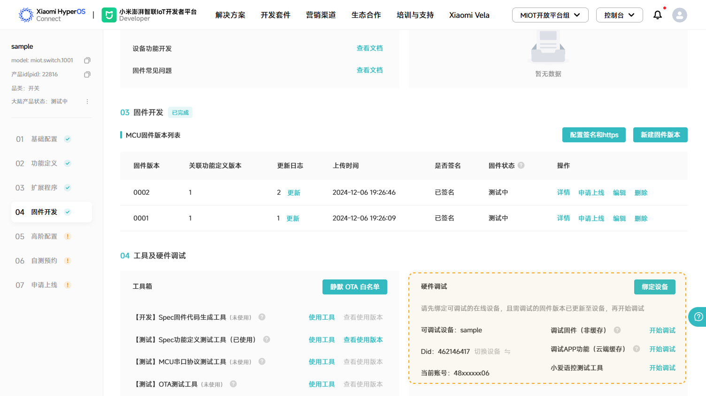

14. 确认页面展示的 DID 与设备实际 DID 一致。设备 DID 可从模组日志或扩展程序的“设置 → 更多设备信息”中获取。

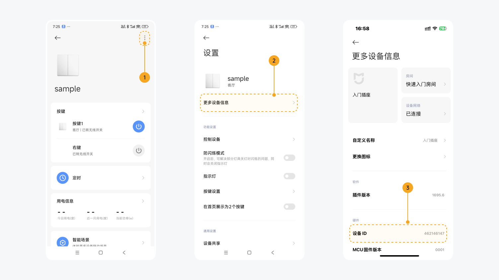

15. 进入小爱语控测试工具，点击测试按钮。
16. 确认当前开关设备支持的小爱语控指令测试通过。

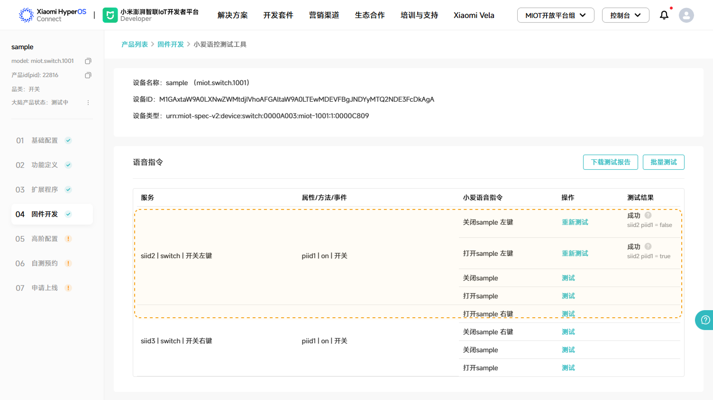

17. 使用小爱语控工具打开或关闭开关时，确认串口调试助手可看到对应的设置设备状态下行指令。
18. 当平台存在更新版本时，进入米家 App 并点击设备扩展程序。
19. 确认 App 可展示固件升级提示。

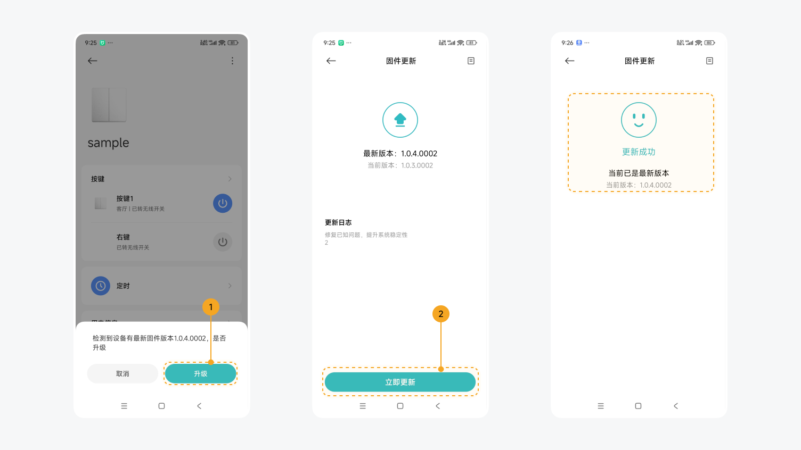

20. 使用 AIoT 测试工具进行 OTA 压力测试。
21. 依次选择 Wi-Fi → OTA 测试 (Wi-Fi) → 打开工具。

22. 选择线上环境、待测设备和对应升降级版本。
23. 设置升降级 100 次并启动测试。
24. 确认 OTA 压力测试全部成功。

**联调验证闭环**：日志只能证明模组与云端、模组与 MCU 的消息交互正常。真实产品还必须验证 MCU 执行指令后，硬件状态、串口日志和 App 显示一致。

| 验证对象 | 验证方法 | 通过标准 |
| --- | --- | --- |
| 硬件动作 | 点击扩展程序开关后，观察继电器、指示灯或真实负载状态；有条件时可在安全前提下用万用表测量输出引脚电平 | 硬件状态与 App 中开关状态一致 |
| 串口日志 | 查看 `set_properties`、`get_properties`、`properties_changed` 对应日志 | 指令、回复和上报值与 Spec 定义一致 |
| App 状态 | 执行开关控制后退出再进入设备页，或触发 `get_properties` 查询 | App 展示状态与设备真实状态一致 |
| OTA 升级 | 升级前后记录固件版本，完成升级后重新进入扩展程序并执行一次开关控制 | 固件版本更新成功，基础控制能力仍可用 |

**常见问题**：

- 设备控制失败：先参考 [设备控制常见问题排查](https://iot.mi.com/v2/new/doc/help-support/faq/spec/wifi)，再按“App → 云端 → 模组 → MCU → 硬件”的顺序定位失败环节。
- App 显示成功但硬件不动作：优先排查 MCU 控制逻辑、硬件接线、继电器或真实负载。
- 硬件已动作但 App 状态不同步：检查 `properties_changed` 是否主动上报，以及 `get_properties` 返回值是否读取真实状态。
- OTA 测试失败：参考 [OTA 常见问题排查](https://iot.mi.com/v2/new/doc/help-support/faq/ota/wifi)，确认版本号、升级包、设备当前版本和目标版本是否匹配。

### 第 13 步 - 完成高阶配置必填项

在左侧主流程中点击【高阶配置】，完成设备配网引导、使用帮助、产品百科和文案多语言配置。更多要求请参考 [高阶配置页面填写要求](https://iot.mi.com/v2/new/doc/configuration/advance-configure/network-distribution)。

| 配置项 | 配置目的 | 填写建议 |
| --- | --- | --- |
| 配网引导 | 帮助用户按正确方式让设备进入可添加状态 | 标题写清楚动作，例如“长按开关键 5 秒进入配网”；图片应突出按键、指示灯和状态变化 |
| 使用帮助 | 在用户遇到配网、控制、离线等问题时提供自助排查入口 | 至少准备配网失败、设备离线、控制无响应、OTA 失败等常见问题 |
| 产品百科 | 补充产品说明书、购买入口或售后信息 | 电子说明书和链接需与实际上市产品一致，避免使用测试链接 |
| 文案多语言 | 支持海外或多语言展示场景 | 功能名称、配网文案、错误提示应保持术语一致，不要逐字机翻 |

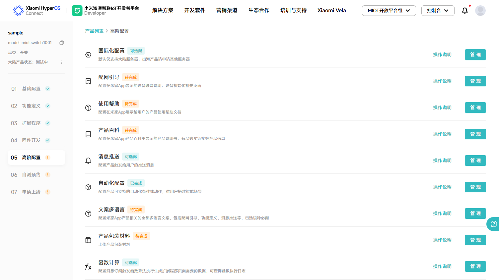

#### 配网引导

1. 点击【管理】，进入设备配网引导配置页面。
2. 当前产品不需要与其他产品共用米家 App 添加入口时，合并快连入口选项保持默认。
3. 在产品初始化引导区域点击【编辑】。
4. 填写引导标题和引导说明。示例：标题可写“让设备进入配网模式”，说明可写“长按开关键 5 秒，直到指示灯开始闪烁”。
5. 点击“+”上传引导图片，具体要求请参考 [配网引导配置要求](https://iot.mi.com/v2/new/doc/configuration/advance-configure/network-distribution)。
6. 点击【保存】，完成配网引导配置。

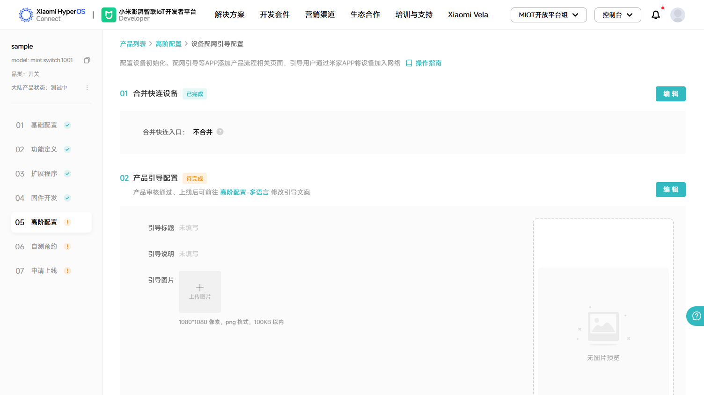

#### 使用帮助

1. 点击【管理】，进入使用帮助配置页面。
2. 通过【新建文档】录入目录、标题和正文，或通过【导入】填写文档模板批量导入常见问题。
3. 建议至少包含“设备无法配网”“设备离线”“App 控制无响应”“固件升级失败”等条目。
4. 保存配置，具体要求请参考 [使用帮助配置要求](https://iot.mi.com/v2/new/doc/configuration/advance-configure/help)。

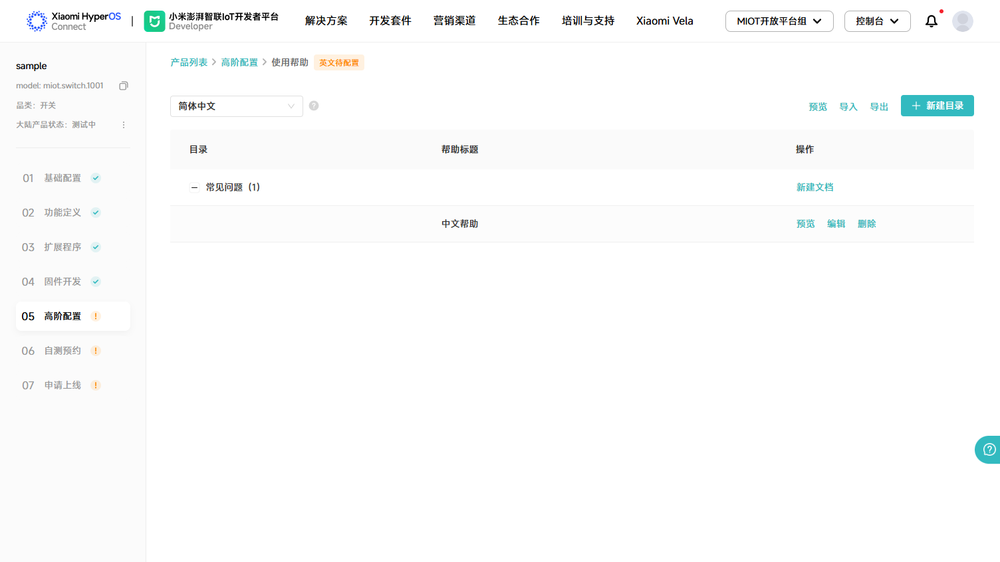

#### 产品百科

1. 点击【管理】，进入产品百科配置页面。
2. 点击右上角【编辑】。
3. 按要求填写电子说明书、有品购买链接等内容，具体要求请参考 [产品百科配置要求](https://iot.mi.com/v2/new/doc/configuration/advance-configure/encyclopedia)。测试阶段可先填写内部验证链接，申请上线前需替换为正式资料。
4. 填写完成后，点击右上角【保存】。
5. 点击【提交审核】。

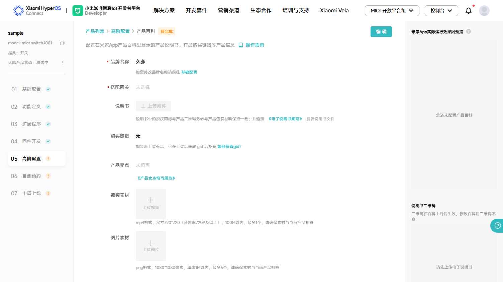

#### 文案多语言

1. 点击【管理】，进入文案多语言配置页面。
2. 选择基础配置，点击【编辑】。
3. 填写对应英文文案，点击【保存】，完成基础配置英文文案。
4. 依次选择功能定义、配网引导、消息推送和自动化，重复编辑、填写和保存操作。
5. 确认全部必填文案均已完成多语言配置。

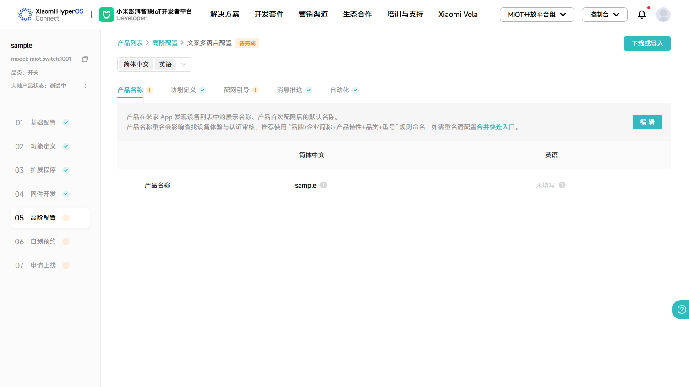

**预期结果**：高阶配置页面不再提示必填项缺失，配网引导、使用帮助、产品百科和多语言文案均保存成功。

**生效验证**：使用测试账号重新添加设备，确认配网引导按配置展示；进入设备扩展程序或设置页，确认使用帮助、产品百科和多语言文案可见且内容正确。

### 第 14 步 - 完成自测

1. 在左侧主流程中点击【自测预约】，进入预约页面。
2. 下载测试指导文件。
3. 本示例为开关品类，按页面下载的《MIoT-LAB-SOP-A-101-V2.3 小米 IoT 平台非米系产品认证提测检查清单.xlsx》或平台最新检查清单完成测试。
4. 确认软硬件功能、配网、控制、状态上报、OTA、高阶配置等必填项均符合验收要求。具体要求请参考 [自测与预约流程说明](https://iot.mi.com/v2/new/doc/configuration/test-guide)。

自测时至少需要覆盖以下检查项：

| 检查项 | 验证重点 |
| --- | --- |
| 配网 | 设备可被米家 App 发现、添加和绑定到正确账号 |
| 控制 | App 下发控制后，MCU、硬件动作和 App 状态一致 |
| 状态上报 | 设备状态变化后，App 能同步刷新 |
| OTA | 固件升降级流程可完成，升级后基础功能仍正常 |
| 高阶配置 | 配网引导、使用帮助、产品百科和多语言文案展示正确 |

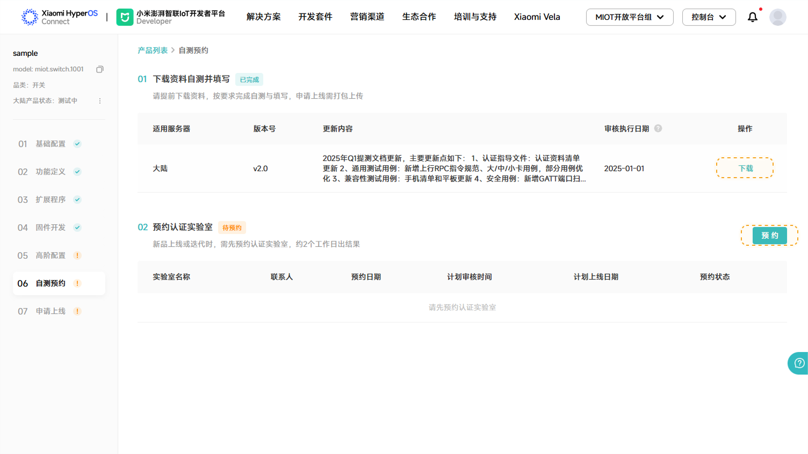

### 第 15 步 - 申请上线

1. 在左侧主流程中点击【产品申请上线】，进入申请上线流程。
2. 点击【申请上线】。
3. 在申请上线页面检查全部检查项，确保每项检查结果均为“√”。具体要求请参考 [产品申请上线流程说明](https://iot.mi.com/v2/new/doc/configuration/publish-product)。
4. 点击右上角【申请上线】，完成申请。

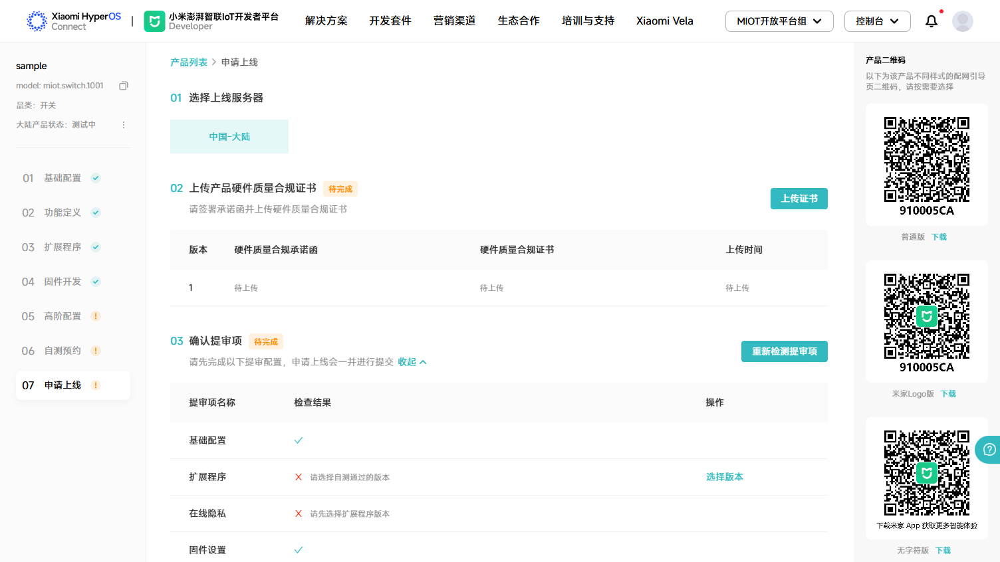

**预期结果**：申请上线页面所有检查项均通过，平台接受上线申请。若存在未通过项，应返回对应配置页面修正后重新检查，不建议带着未确认问题提交。

完成以上步骤后，产品基础配置、功能定义、标准扩展程序、固件版本、产品联调、高阶配置、自测资料和上线检查项均已满足必填接入要求。
