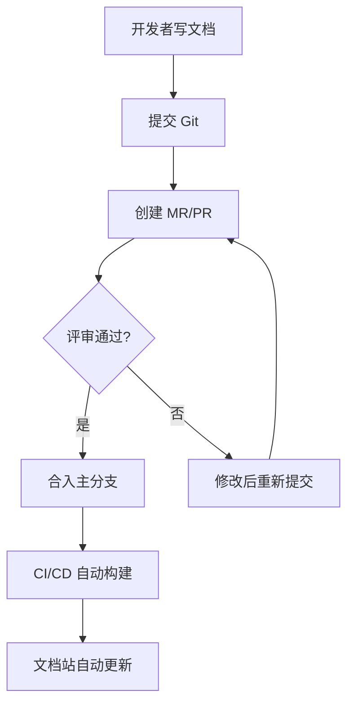
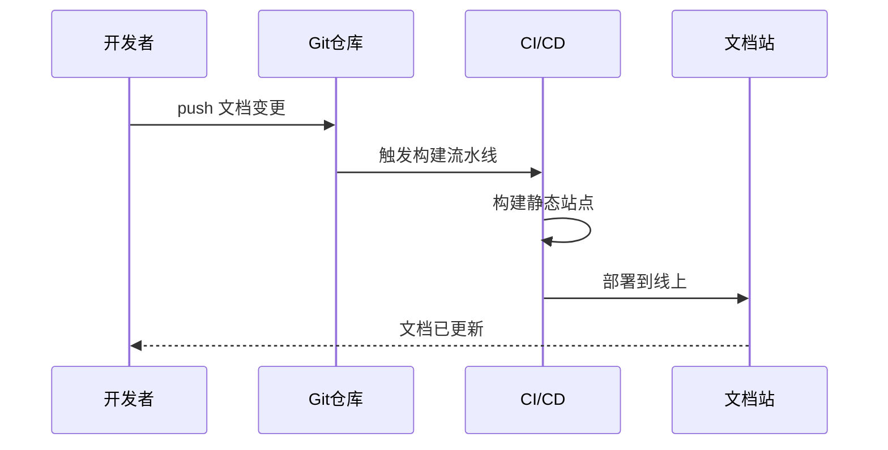
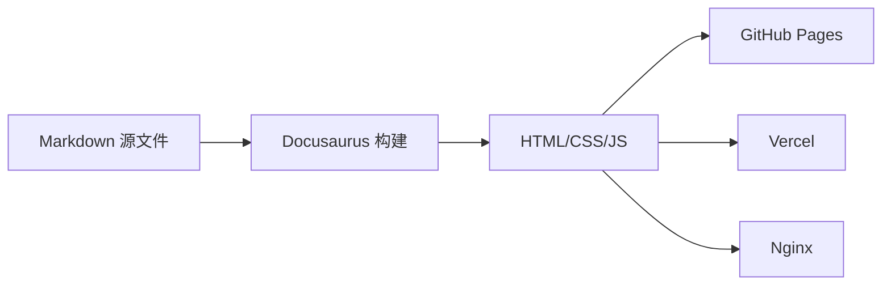

# Mermaid 图表演示

## 流程图

```mermaid
flowchart TD
    A[开发者写文档] --> B[提交 Git]
    B --> C[创建 MR/PR]
    C --> D{评审通过?}
    D -->|是| E[合入主分支]
    D -->|否| F[修改后重新提交]
    F --> C
    E --> G[CI/CD 自动构建]
    G --> H[文档站自动更新]
```

## 时序图

```mermaid
sequenceDiagram
    participant 开发者
    participant Git仓库
    participant CI/CD
    participant 文档站

    开发者->>Git仓库: push 文档变更
    Git仓库->>CI/CD: 触发构建流水线
    CI/CD->>CI/CD: 构建静态站点
    CI/CD->>文档站: 部署到线上
    文档站-->>开发者: 文档已更新
```

## 架构图

```mermaid
graph LR
    A[Markdown 源文件] --> B[Docusaurus 构建]
    B --> C[HTML/CSS/JS]
    C --> D[GitHub Pages]
    C --> E[Vercel]
    C --> F[Nginx]
```

这些图全部是用文本代码生成的，不需要任何画图工具。
